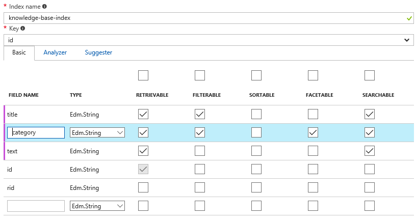
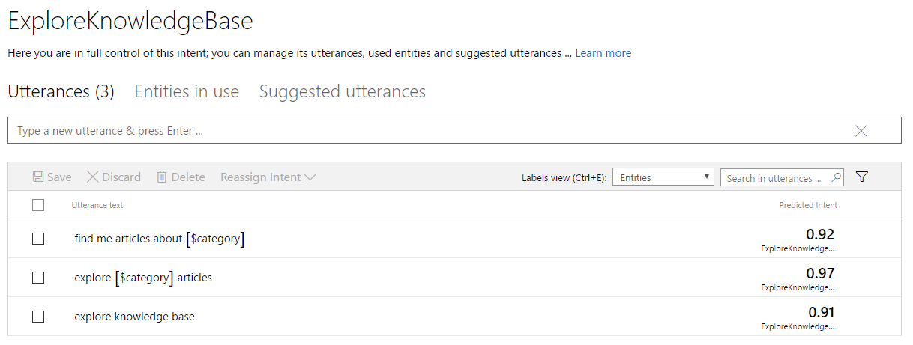
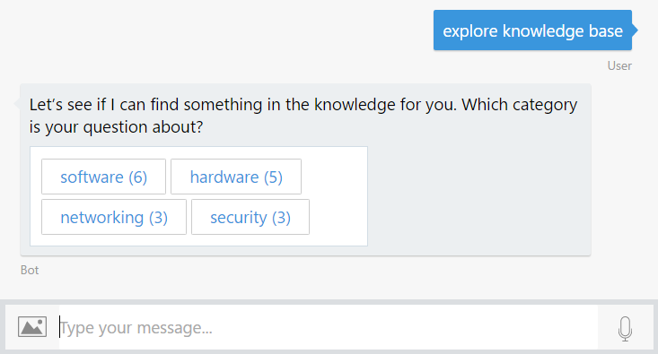
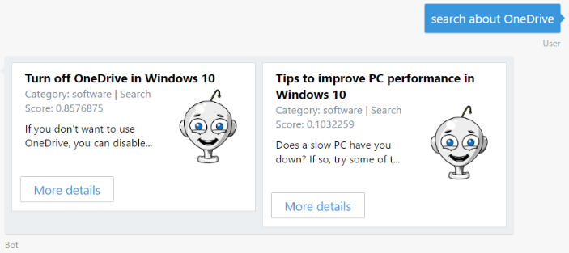

# Exercise 4: Implementing a Help Desk Knowledge Base with Azure Search and Cosmos DB (C#)

## Introduction

Your bots can also help the user navigate large amounts of content and create a data-driven exploration experience for users. In this exercise you will learn how to add search functionality to the bot to help users explore a knowledge base. To do this, you will connect the Bot to the Azure Search service that will index KB articles stored in an Azure Cosmos DB.

[Azure Cosmos DB](https://azure.microsoft.com/en-us/services/cosmos-db/) is Microsoft's globally distributed, multi-model database service for mission-critical applications. It supports different data models. In this exercise you will use its Document DB API, that will allow you to store knowledge base articles as JSON documents.

[Azure Search](https://azure.microsoft.com/en-us/services/search/) is a fully managed cloud search service that provides a rich search experience to custom applications. Azure Search can also index content from various sources (Azure SQL DB, Cosmos DB, Blob Storage, Table Storage), supports "push" indexing for other sources of data, and can open PDFs, Office documents and other formats containing unstructured data. The content catalog goes into an Azure Search index, which you can then query from bot dialogs.

> **NOTE:** While this lab uses Azure Search and Azure Cosmos DB, you can of course use any search engine and backing store you desire.

Inside [this folder](./exercise4-KnowledgeBase) you will find a solution with the code that results from completing the steps in this exercise. You can use this solution as guidance if you need additional help as you work through this exercise. Remember that before using it, you first need to complete the placeholders of the LUIS Model and Azure Search Index name and key in Web.config.

## Prerequisites

The following software is required for completing this exercise:

* [Visual Studio 2017 Community](https://www.visualstudio.com/downloads) or higher
* An [Azure](https://azureinfo.microsoft.com/us-freetrial.html?cr_cc=200744395&wt.mc_id=usdx_evan_events_reg_dev_0_iottour_0_0) subscription
* The [Bot Framework Emulator](https://emulator.botframework.com)
* An account in the [LUIS Portal](https://www.luis.ai)

## Task 1: Create a Cosmos DB Service and Upload the Knowledge Base

In this task you will create a Cosmos DB database and upload some documents that will be consumed by your bot. If you're unsure about how Azure Cosmos DB works, you can check the [documentation](https://docs.microsoft.com/en-us/azure/cosmos-db/).

1. Navigate to the [Azure portal](https://portal.azure.com) and sign in. Click on the **New** button () on the left bar, next on **Databases** and then choose **Azure Cosmos DB**.

1. In the dialog box, type a unique account ID (eg. _help-desk-bot_), select **SQL (DocumentDB)** as the *API*. Type a new resource group name and click **Create**.

    

1. Wait until the deployment finishes. Open the previously created *Cosmos DB account* and navigate to the **Overview** section. Click on the **Add Collection** button. In the dialog box, type _knowledge-base_ as the *Collection Id*, select **Fixed** as the storage capacity and type _knowledge-base-db_ as the *database name*. Click *OK*.

    

1. Select **Document Explorer** on the left pannel, and next click on the **Upload** button.

1. On the opened window pick up all the files in the [assets/kb](../assets/kb) folder. Each one represents an article from the knowledge base. Click **Upload**. Do not close the browser.

    

    > **NOTE:** Each article "document" has three fields: title, category and text.

## Task 2: Create an Azure Search Service

In this task you will create an Azure Search Service to index the content uploaded to Cosmos DB.

1. In the Azure Portal, click **New** () on the left bar, next on **Web + Mobile**, choose **Azure Search** and click on the **Create** button. Type a unique *URL* (eg. _help-desk-bot-search_) and save it for later use. Choose the same resource group you have used for the Cosmos DB. Change the *Price Tier* to **Free** and click **Create**.

    

1. Once the service is provisioned, navigate to the *Overview* and then click the **Import data** button ().

1. Click the **Connect to your data** button and **DocumentDB** next. Type _knowledge-base-datasource_ on the data source *name*. Select the *Cosmos DB Account*, *Database* and *Collection* you just created. Click **OK**.

    

1. Click the **Index - Customize target index** button. Type _knowledge-base-index_ as Index Name. Update the check boxes in the columns so that the index definition matches the following image. Click **OK**.

    Notice that the category field is marked as Filterable and Facetable. This will allow you to retrieve all the articles that match a category, and also, retrieve the number of articles in each category. In Azure Search terminology, this is called _Faceted Navigation_.

    

    > **NOTE:** For more information about Indexes, see [this article](https://docs.microsoft.com/en-us/azure/search/search-what-is-an-index).

1. Finally click on the **Indexer - Import your data** button. Enter _knowledge-base-indexer_ as *Name*. Ensure **Once** is selected as the *Schedule*. Click **OK**.

    

1. Click **OK** again to close the *Import Data* dialog.

1. Click on **Keys** on the left, and next click on **Manage query keys**. Save the default Azure Search key (identified by the **&lt;empty&gt;** name) for the next task.

    

    > **NOTE:** The query key, unlike the admin keys, can only be used to perform read-only operations on your Search indexes such as querying and looking up documents by ID. Your primary and secondary admin keys grant full rights to all operations, including the ability to manage the service, create and delete indexes, indexers, and data sources.

## Task 3: Update the LUIS Model to Include the ExploreKnowledgeBase Intent

In this task you will add a new Intent to LUIS to explore the Knowledge Base.

1. Sign in to the [LUIS Portal](https://www.luis.ai/). Edit the App you created on Exercise 3.

1. Click on **Intents** on the left menu and next click on the **Add Intent** button. Type _ExploreKnowledgeBase_ as the *Intent name* and then add the following utterances:

    * _explore knowledge base_
    * _explore hardware articles_
    * _find me articles about hardware_

    

1. Click **Save**.

1. Click on the **Publish App** link on the left. Click on the **Train** button and when it finishes, clicks the **Publish** button.

## Task 4: Update the Bot to call the Azure Search API

In this task you will add a dialog to handle the Intent you just created and call the *Azure Search* service.

1. Open the solution you've obtained from the previous exercise. Alternatively, you can use [this](./exercise3-LuisDialog) solution as a starting point. If you do so, replace the **[LuisModel()]** attribute in the `RootDialog` with your own `modelID` and `subscriptionKey`.

1. In order to use the *Azure Search* service created in the previous task you have to add the following keys in the `Web.config` in the appSettings section replacing the `{AzureSearchAccountName}` and `{AzureSearchKey}` with yours.

    ``` xml
    ...
    <add key="AzureSearchAccount" value="{AzureSearchAccountName}" />
    <add key="AzureSearchIndex" value="knowledge-base-index" />
    <add key="AzureSearchKey" value="{AzureSearchKey}" />
    ...
    ```

1. Add a new `Model` folder to your project. In the new folder, copy [`SearchResult.cs`](../assets/search/SearchResult.cs) and [`SearchResultHit.cs`](../assets/search/SearchResultHit.cs) from the assets folder. These clases will handle the search of articles from Azure.

1. Create a `Services` folder in the project and add an `AzureSearchService` class inside with the following code.

    ``` csharp
    namespace HelpDeskBot.Services
    {
        using Model;
        using Newtonsoft.Json;
        using System;
        using System.Net.Http;
        using System.Threading.Tasks;
        using System.Web.Configuration;

        [Serializable]
        public class AzureSearchService
        {
            private readonly string QueryString = $"https://{WebConfigurationManager.AppSettings["AzureSearchAccount"]}.search.windows.net/indexes/{WebConfigurationManager.AppSettings["AzureSearchIndex"]}/docs?api-key={WebConfigurationManager.AppSettings["AzureSearchKey"]}&api-version=2015-02-28&";

            public async Task<SearchResult> SearchByCategory(string category)
            {
                using (var httpClient = new HttpClient())
                {
                    string nameQuey = $"{QueryString}$filter=category eq '{category}'";
                    string response = await httpClient.GetStringAsync(nameQuey);
                    return JsonConvert.DeserializeObject<SearchResult>(response);
                }
            }
        }
    }
    ```

1. Inside the `Dialogs` folder, create a new `CategoryExplorerDialog` class to perform the interactions with Azure Search.

    ``` csharp
    namespace HelpDeskBot.Dialogs
    {
        using Microsoft.Bot.Builder.Dialogs;
        using Model;
        using Services;
        using System;
        using System.Collections.Generic;
        using System.Text.RegularExpressions;
        using System.Threading.Tasks;
        using Util;

        [Serializable]
        public class CategoryExplorerDialog : IDialog<object>
        {
            private readonly AzureSearchService searchService = new AzureSearchService();
            private string category = null;

            public CategoryExplorerDialog(string category)
            {
                this.category = category;
            }

            public async Task StartAsync(IDialogContext context)
            {
                if (string.IsNullOrWhiteSpace(this.category))
                {
                    await context.PostAsync($"Try typing something like _explore hardware_.");
                    context.Done<object>(null);
                }
                else
                {
                    SearchResult searchResult = await this.searchService.SearchByCategory(this.category);
                    string message;
                    if (searchResult.Value.Length != 0)
                    {
                        message = $"These are some articles I've found in the knowledge base for the _'{this.category}'_ category:";
                        foreach (var item in searchResult.Value)
                        {
                            message += $"\n * {item.Title}";
                        }
                    }
                    else
                    {
                        message = $"Sorry, I could not find any results in the knowledge base for _'{this.category}'_";
                    }
                    await context.PostAsync(message);
                    context.Done<object>(null);
                }
            }
        }
    }
    ```

1. Now, in the `RootDialog` class add an `ExploreCategory` method to handle the new **ExploreKnowledgeBase** intent and retrieve from Azure Search a list of articles within the category entered by the user.

    ``` csharp
    [LuisIntent("ExploreKnowledgeBase")]
    public async Task ExploreCategory(IDialogContext context, LuisResult result)
    {
        EntityRecommendation categoryEntityRecommendation;
        result.TryFindEntity("category", out categoryEntityRecommendation);
        var category = ((Newtonsoft.Json.Linq.JArray)categoryEntityRecommendation?.Resolution["values"])?[0]?.ToString();

        context.Call(new CategoryExplorerDialog(category), this.ResumeAfterCategoryAsync);
    }

    private async Task ResumeAfterCategoryAsync(IDialogContext context, IAwaitable<object> argument)
    {
        context.Done<object>(null);
    }
    ```

## Task 5: Test your Bot at this Point

1. Run the app by clicking the **Run** button and open the emulator. Type the bot URL as usual (`http://localhost:3979/api/messages`).

1. Type `explore hardware`. Notice that the bot lists the articles within that *category*. You can also try with other categories values (networking, software, etc.).

    

## Task 6: Update the Bot to Display Categories and Articles

In this task you will update your bot code to navigate the Knowledge Base by category and retrieve information about a specific subject.

1. Stop the app.

1. Copy [`FacetResult.cs`](../assets/search/FacetResult.cs), [`SearchFacets.cs`](../assets/search/SearchFacets.cs) and [`Category.cs`](../assets/search/Category.cs) files from the assets folder to the `Model` folder of the project. These classes are needed to query the Azure Search service.

1. In the `AzureSearchService` class add the following methods.

    * Add the `FetchFacets` method to retrieve the `Categories` and list them.

        ``` csharp
        public async Task<FacetResult> FetchFacets()
        {
            using (var httpClient = new HttpClient())
            {
                string facetQuey = $"{QueryString}facet=category";
                string response = await httpClient.GetStringAsync(facetQuey);
                return JsonConvert.DeserializeObject<FacetResult>(response);
            }
        }
        ```

        Notice that this is done using the `facet=category` query. This will retrieve from the index all the possible "category filters" for all the articles (in this case, software, hardware, networking and so on). Also, Azure Search returns the number of articles in each facet.

    * Add the `SearchByTitle` method retrieve an article.

        ``` csharp
        public async Task<SearchResult> SearchByTitle(string title)
        {
            using (var httpClient = new HttpClient())
            {
                string nameQuey = $"{QueryString}$filter=title eq '{title}'";
                string response = await httpClient.GetStringAsync(nameQuey);
                return JsonConvert.DeserializeObject<SearchResult>(response);
            }
        }
        ```

        > **NOTE:** For simplicity purposes, the article content is retrieved directly from Azure Search. However, in a production scenario, Azure Search would only work as the index and the full article would be retrieved from Cosmos DB.

    * Add the `Search` method to do a generic search.

        ``` csharp
        public async Task<SearchResult> Search(string text)
        {
            using (var httpClient = new HttpClient())
            {
                string nameQuey = $"{QueryString}search={text}";
                string response = await httpClient.GetStringAsync(nameQuey);
                return JsonConvert.DeserializeObject<SearchResult>(response);
            }
        }
        ```

        > **NOTE:** In Azure Search, A `search=...` query searches for one or more terms in all searchable fields in your index, and works the way you would expect a search engine like Google or Bing to work. A `filter=...` query evaluates a boolean expression over all filterable fields in an index. Unlike search queries, filter queries match the exact contents of a field, which means they are case-sensitive for string fields.

1. Copy the [`CardUtil.cs`](../assets/search/CardUtil.cs) file from the assets folder to the `Util` folder of the project. This class is used to create a carrousel of HeroCards with the list of articles from Azure Search. For more information about how to show rich cards to users see [this article](https://docs.microsoft.com/en-us/bot-framework/nodejs/bot-builder-nodejs-send-rich-cards).

1. Copy [`SearchScorable.cs`](../assets/search/SearchScorable.cs) and [`ShowArticleDetailsScorable.cs`](../assets/search/ShowArticleDetailsScorable.cs) from the assets folder to the `Dialogs` folder of the project. These classes are scorables that intercepts every message sent to the bot and trigger the search service:

    * `SearchScorable` will be triggered if the message starts with '_search about_' and will call the `Search` method of the `AzureSearchService`.
    * `ShowArticleDetailsScorable` will be triggered if the message starts with '_show details of article_' and will call the `SearchByTitle` method of the `AzureSearchService`.

    `Scorables` intercept every message sent to a conversation and apply a score to the message based on logic you define. The Scorable with the highest score 'wins' the opportunity to process the message, rather the message being sent to the Conversation. You can implement global message handlers by creating a Scorable for each global command you want to implement in your bot. For more information about `Scorables`, see [this sample](https://github.com/Microsoft/BotBuilder-Samples/tree/master/CSharp/core-GlobalMessageHandlers).

1. Open the `Global.asax.cs` and add the following using statements.

    ```csharp
    using Autofac;
    using HelpDeskBot.Dialogs;
    using Microsoft.Bot.Builder.Dialogs;
    using Microsoft.Bot.Builder.Scorables;
    using Microsoft.Bot.Connector;
    ```

1. In the same file replace the `Application_Start` method with the following code to register the `scorables` in the Conversation Container.

    ``` csharp
    protected void Application_Start()
    {
        GlobalConfiguration.Configure(WebApiConfig.Register);

        var builder = new ContainerBuilder();

        builder.RegisterType<SearchScorable>()
            .As<IScorable<IActivity, double>>()
            .InstancePerLifetimeScope();

        builder.RegisterType<ShowArticleDetailsScorable>()
            .As<IScorable<IActivity, double>>()
            .InstancePerLifetimeScope();

        builder.Update(Conversation.Container);
    }
    ```

1. In the `CategoryExplorerDialog` add an `originalText` variable and update its constructor to receive it and set it.

    ``` csharp
    private string originalText = null;

    public CategoryExplorerDialog(string category, string originalText)
    {
        this.category = category;
        this.originalText = originalText;
    }
    ```

1. Change the `StartAsync` implementation to retrieve a list of categories if the bot doesn't found a `category` in the original message. Replace the method code with the following code.

    ``` csharp
    public async Task StartAsync(IDialogContext context)
    {
        if (string.IsNullOrWhiteSpace(this.category))
        {
            FacetResult facetResult = await this.searchService.FetchFacets();
            if (facetResult.Facets.Category.Length != 0)
            {
                List<string> categories = new List<string>();
                foreach (Category category in facetResult.Facets.Category)
                {
                    categories.Add($"{category.Value} ({category.Count})");
                }

                PromptDialog.Choice(context, this.AfterMenuSelection, categories, "Let\'s see if I can find something in the knowledge for you. Which category is your question about?");
            }
        }
        else
        {
            SearchResult searchResult = await this.searchService.SearchByCategory(this.category);

            if (searchResult.Value.Length > 0)
            {
                await context.PostAsync($"These are some articles I\'ve found in the knowledge base for _'{this.category}'_, click **More details** to read the full article:");
            }

            await CardUtil.ShowSearchResults(context, searchResult, $"Sorry, I could not find any results in the knowledge base for _'{this.category}'_");

            context.Done<object>(null);
        }
    }
    ```

1. Add an `AfterMenuSelection` method that will be called when the user selects a category to search for.

    ``` csharp
    public virtual async Task AfterMenuSelection(IDialogContext context, IAwaitable<string> result)
    {
        this.category = await result;
        this.category = Regex.Replace(this.category, @"\s\([^)]*\)", string.Empty);

        SearchResult searchResult = await this.searchService.SearchByCategory(this.category);
        await context.PostAsync($"These are some articles I\'ve found in the knowledge base for _'{this.category}'_, click **More details** to read the full article:");

        await CardUtil.ShowSearchResults(context, searchResult, $"Sorry, I could not find any results in the knowledge base for _'{this.category}'_");
        context.Done<object>(null);
    }
    ```

1. Finally, in the `RootDialog` update the `ExploreCategory` method to match the signature of `CategoryExplorerDialog`.

    ``` csharp
    [LuisIntent("ExploreKnowledgeBase")]
    public async Task ExploreCategory(IDialogContext context, LuisResult result)
    {
        EntityRecommendation categoryEntityRecommendation;
        result.TryFindEntity("category", out categoryEntityRecommendation);
        var category = ((Newtonsoft.Json.Linq.JArray)categoryEntityRecommendation?.Resolution["values"])?[0]?.ToString();

        context.Call(new CategoryExplorerDialog(category, result.Query), this.ResumeAfterCategoryAsync);
    }
    ```

1. Additionally you can update the text in the `Help` method to include the knowledge base functionality.

    ``` csharp
    [LuisIntent("Help")]
    public async Task Help(IDialogContext context, LuisResult result)
    {
        await context.PostAsync("I'm the help desk bot and I can help you create a ticket or explore the knowledge base.\n" +
                                "You can tell me things like _I need to reset my password_ or _explore hardware articles_.");
        context.Done<object>(null);
    }
    ```

## Task 7: Test the Bot from the Emulator

1. Run the app clicking in the **Run** button and open the emulator. Type the bot URL as usual (`http://localhost:3979/api/messages`).

1. Type `explore knowledge base`. You should get a list of the article categories you uploaded to Cosmos DB, with the number of articles in each category.

    

1. Click on any of the categories listed and you should see the articles for that category.

    

1. Click the **More details** button of an article and you should see the full article text.

    

1. You can try to explore a specific category. Type `explore software` and you should see some articles within that category.

    

1. You can try to search for articles about one topic as well. For example type `search about OneDrive`.

    

    > **NOTE:** Notice that the search returns the score or relevancy of each document returned.