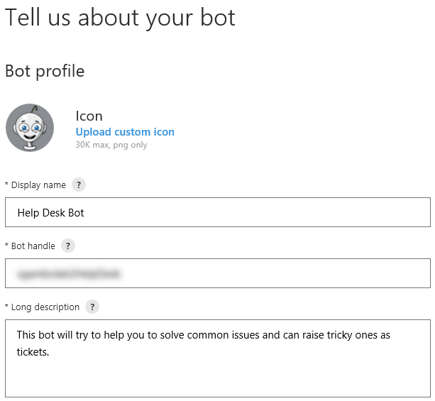
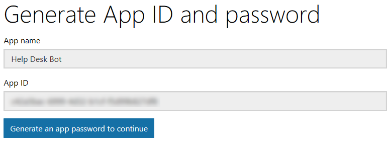
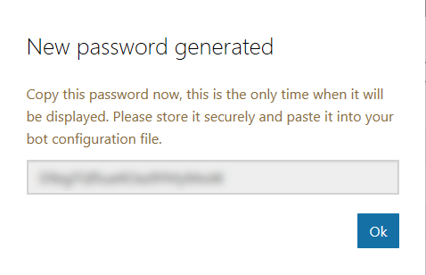
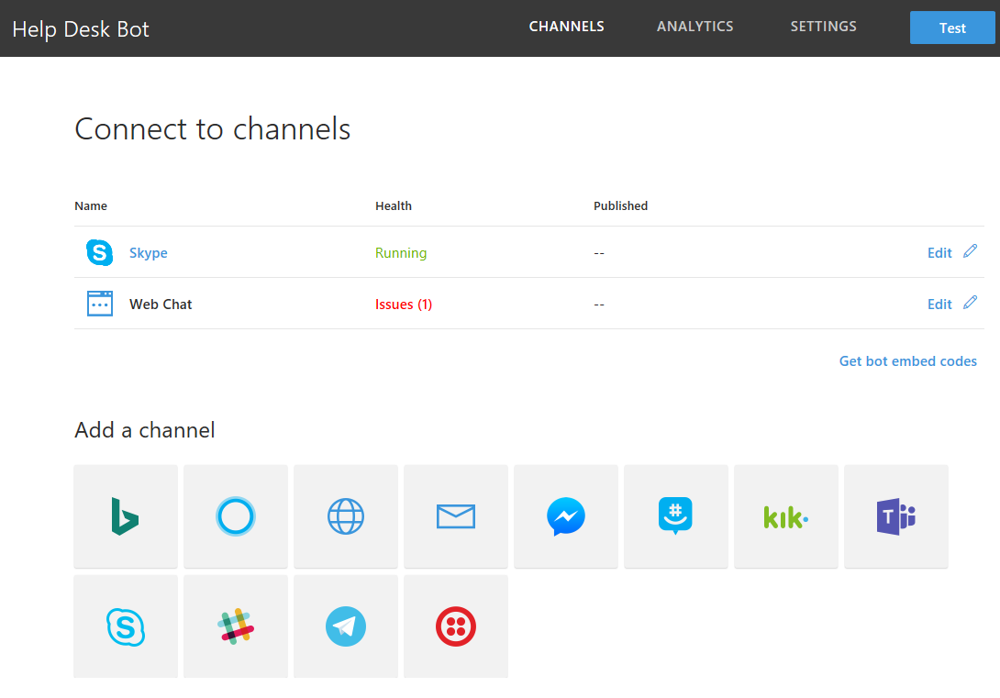
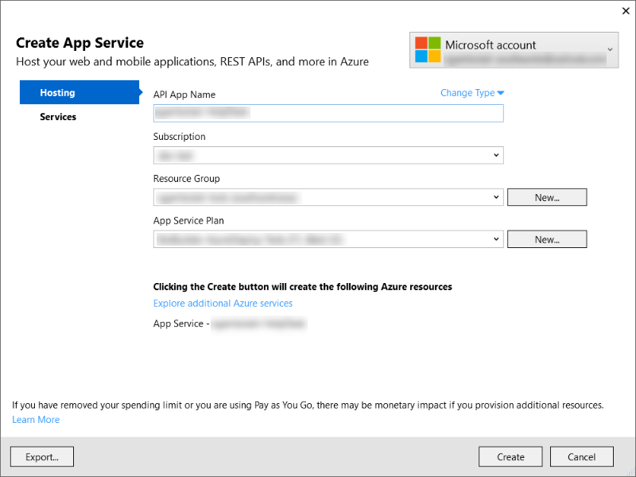
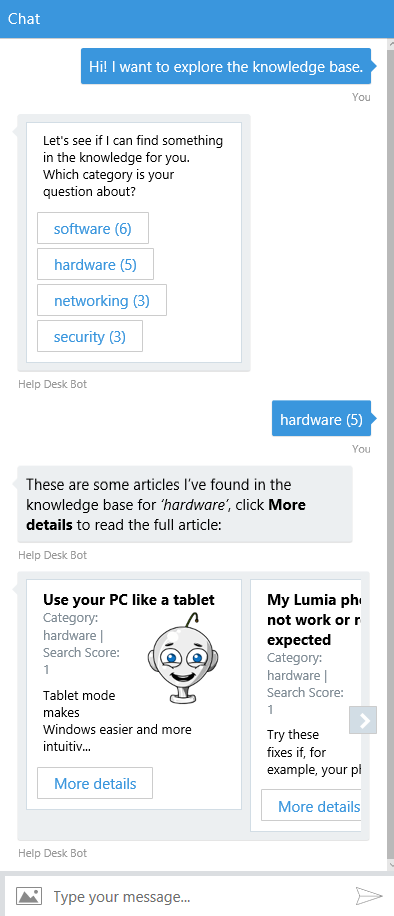
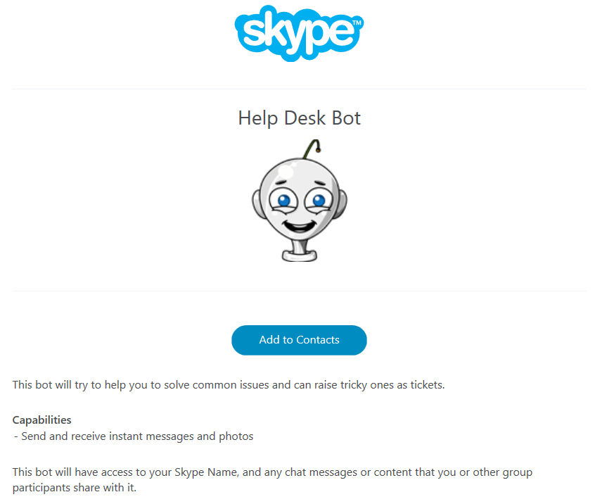
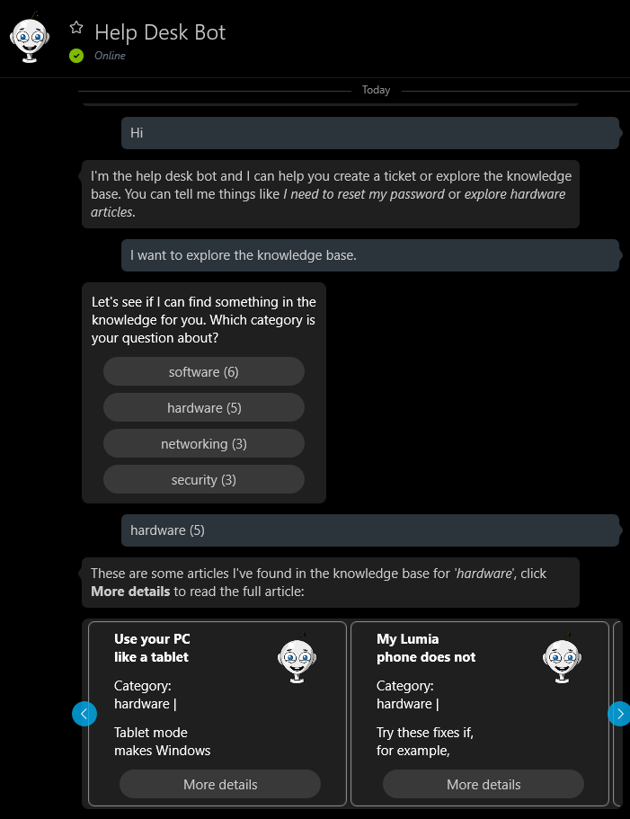

# Exercise 5: Deploying Your Bot to the Cloud (C#)

## Introduction

In this exercise you will learn how to register your bot and deploy it to Azure so others can use it.

## Prerequisites

The following software is required for completing this exercise:

* Install [Visual Studio 2017 Community](https://www.visualstudio.com/downloads/) or higher
* An [Azure](https://azureinfo.microsoft.com/us-freetrial.html?cr_cc=200744395&wt.mc_id=usdx_evan_events_reg_dev_0_iottour_0_0) Subscription
* The [Bot Framework Emulator](https://emulator.botframework.com/)
* An account in the [LUIS Portal](https://www.luis.ai)
* An [Skype](https://www.skype.com) account (optional)

## Task 1: Register the Bot with the Bot Framework

In this task you will generate an _App ID_ and _App Password_, and register your bot.

1. Sign in to the [Bot Framework Portal](https://dev.botframework.com).

1. Click the **My bots** button and next click the **Register** button.

1. Type _Help Desk Bot_ as **Display Name**. Enter a globally unique App Name in the **Bot Handle**.

1. For **Long Description** enter _This bot will try to help you to solve common issues and can raise tricky ones as tickets._ or any other text that you feel comfortable. This is the description that will appear in search results, so it should accurately describe what the bot does.

    

1. On the **Configuration** section, click on the **Create Microsoft AppID and Password** button and a new page should open. If required, sign in again with the same credentials you use in the Bot Framework portal. In this page, you should see the App name you have entered prior and an **App ID** which was auto-generated. Save the **App ID** for later uses and click on the **Generate an app password to continue**.

    

1. You should see a popup which contains an auto-generated password for your Bot. Notice that this is the only time when it will be displayed. **Store it securely** for later usage. Click the **Ok** button to close the popup.

    

1. Click on the **Finish and go back to Bot Framework** button. You may notice the page will close and you will go back to the Bot registration page. Now, you have the _App ID_ auto-completed in the page.

1. Scroll down and confirm your agreement of the _Terms of Use, Privacy Statement, and Code of Conduct_. Click on the _Register_ button. A confirmation message should appear, click *Ok*. And next you may see your bot's dashboard with a few channels available.

    

## Task 2: Publish your Bot to Azure

In this task you will learn how to publish your bot to Windows Azure from Visual Studio.

1. Open the solution you've obtained from the previous exercise. Alternatively, you can open the solution file from the [exercise4-KnowledgeBase](./exercise4-KnowledgeBase) folder.

1. Go to the **Build** menu and there click **Publish Exercise4** (or how you've called your project). A new tab should opens like the following. Select the **Microsoft Azure App Service** and the **Create New** options and click **Publish**.

    

1. A new windows should open. Click on the **Create** button. Next the deployment will start creating the Web App in your subscription. When finished, your default web browser will open redirecting to your site.

    

## Task 3: Configure the Azure Web App

In this task you will learn how to configure your app to enable it to communicate with the Bot framework channels.

1. Open the [Azure portal](https://portal.azure.com) and sign in.

1. Open the previously created _App Service account_. Click on **Application Settings** on the left menu. Navigate to the *App settings* and add the following keys and replace with the values described (you should have these values in your bot source code).

    Key | Description |
    ----|-------------|
    AzureSearchAccount | Use the **Azure Search account name** |
    AzureSearchIndex | Use the **Azure Search index name** |
    AzureSearchKey | Use the **Azure Search key** |
    MicrosoftAppId | Use the **Bot App ID** |
    MicrosoftAppPassword | Use the **Bot Password** |
    TicketsAPIBaseUrl | Use your Web App URL (eg. https://help-desk-bot.azurewebsites.net/) |

    After you entered the key and values you should have a similar result as the image below.

    

1. Click **Save** ().

## Task 4: Update Your Bot Configuration

1. Navigate to [Bot Framework Portal](https://dev.botframework.com). Click on your bot name to edit it.

1. Click on the **Settings** button on the top-right corner of the page.

1. On the _Configuration_ section, type the _App Service URL_ you created on Task 2 (eg. https://help-desk-bot.azurewebsites.net/api/messages). Remember to put the `/api/messages` at the end of the URL and ensure the protocol is **https**. Click the **Save changes** button at the bottom of the page.

    

## Task 5: Test Your Published Bot

In this task you will test your bot from other channels.

1. Navigate to [Bot Framework Portal](https://dev.botframework.com) and edit your bot, if you are not there already.

1. Click on the **Test** button on the top-right corner of the page. It should open a new window on the right of the page. This is an embedded _Web Chat Channel_ so you can easily test your bot.

1. Type `Hi! I want to explore the knowledge base` and see the bot response with the category list. Click on any of the category and see the articles listed for that category and click on one article to see it.

    

1. Click the **Channels** menu item. Note you should have the **Skype** and **Web Chat** channels enabled by default. Click on the **Skype** link. A new page may be opens to allow to add your bot to your **Skype** account. Click on the **Add to Contacts** button. You may be prompted to be sign into your Skype Account and the Skype app should be opened.

    

    > **NOTE:** Check also the **Get bot embed codes** link that shows you how to build a link for users to add the bot to their Skype account.

1. Search for the bot on your Contact List and test a new conversation.

    

    > **NOTE:** Notice that Skype does not fully support Adaptive Cards at this moment and you may not see all the characteristics in that channel.

## Further Challenges

* Test the bot from the Bot Emulator - you need to use ngrok to let the bot know how to reply to your local computer. To do this, you can follow the steps [here](https://docs.microsoft.com/en-us/bot-framework/debug-bots-emulator#a-idngroka-install-and-configure-ngrok).
* You can try adding Bot Analytics by using Application Insights as explained [here](https://docs.microsoft.com/en-us/bot-framework/portal-analytics-overview).
