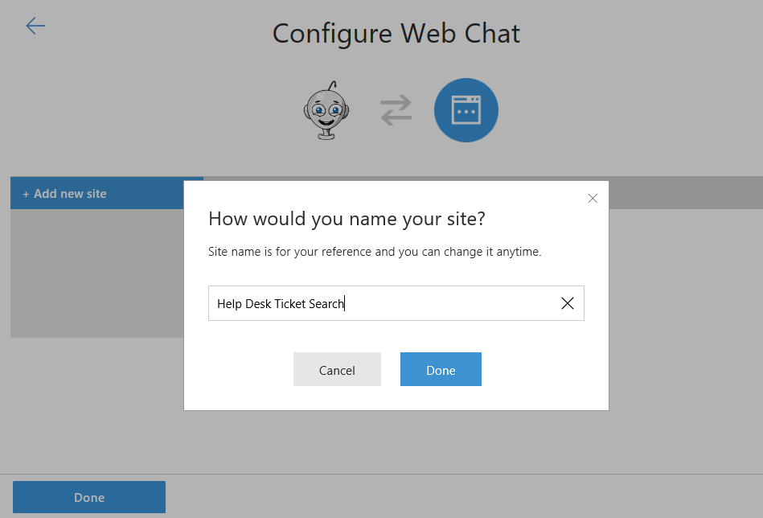
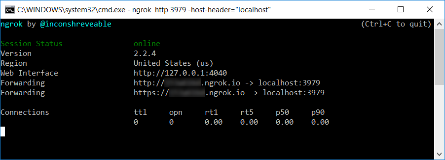

# Exercise 8: Send and Receive Events Through a Backchannel (C#)

## Introduction

The backchannel mechanism allows a client app and the bot to exchange information that is invisible to the user. Examples of this could be from requesting the client's time zone to reading a GPS location or what the user is doing on a web page. The bot can even guide the user by automatically filling out parts of a web form and so on. The backchannel closes the gap between JavaScript client apps and bots. This mechanism is implemented by using the Direct Line API, which allows activities to be sent back and forth between the client and the bot.

In this exercise, you will add a Web Page to your app. The bot and web page will use the backchannel mechanism to communicate. The bot will send the users issue to the web page, which will display related KB articles for that issue. The goal would be that a human supervisor agent can decide if there is an article that can help the user without the creation of a ticket. If he finds one, the supervisor agent clicks the article to display it in the bot conversation.

Inside [this folder](./exercise8-BackChannel) you will find a solution with the code that results from completing the steps in this exercise. You can use this solution as guidance if you need additional help as you work through this exercise. Remember that for using it, you first need to build it by using Visual Studio and complete the placeholders of the LUIS Model and Azure Search Index name and key in `web.config`.

## Prerequisites

The following software is required for completing this exercise:

* [Visual Studio 2017 Community](https://www.visualstudio.com/downloads/) or higher
* An [Azure](https://azureinfo.microsoft.com/us-freetrial.html?cr_cc=200744395&wt.mc_id=usdx_evan_events_reg_dev_0_iottour_0_0) subscription
* The [Bot Framework Emulator](https://emulator.botframework.com/) (make sure it's configured with the `en-US` Locale)
* [ngrok](https://ngrok.com/)

## Task 1: Add a New Site to Your Bot's Web Chat Channel

1. Sign in to the [Bot Framework Portal](https://dev.botframework.com).

1. Click the **My bots** button and click on your bot for editing it.

    > **NOTE:** This exercise assumes that you have already registered your bot in the Bot Framework Portal. If you didn't you can find instructions in [Exercise 5](./exercise5-Deployment.md).

1. Click on the **Edit** () link for the _Web Chat_ channel. In the opened window, click **Add new site**. Type a _site name_ (for example, _Help Desk Ticket Search_).

    

1. Click **Done** and you should see the following page. Notice that you have two **Secret Keys**. Save one of them for later. Click **Done**.

    

## Task 2: Add HTML Page with an Embedded Web Chat

In this task you will add a HTML page to your app which contains the web chat control and the code to send/receive `event` messages to your bot. Next, you will add the BackChannel capability to send `event` activities from your bot to the Web Page.

1. Open the app you've obtained from the previous exercise. Alternatively, you can use the app from the [exercise7-HandOffToHuman](./exercise7-HandOffToHuman) folder.

    > **NOTE:** If you use the solution provided remember to replace:
    > * the **[LuisModel("{LUISAppID}", "{LUISKey}")]** attribute placeholders in `RootDialog.cs` with your LUIS App Id and Programmatic API Key
    > * the **{TextAnalyticsApiKey}** in `Web.config` with your Text Analytics Key (as explained in exercise 6)
    > * the **{AzureSearchAccount}**, **{AzureSearchIndex}** and **{AzureSearchKey}** in `Web.config` with your search account, index name and key (as explained in exercise 4)

1. Replace the `default.htm` with [this template](../assets/exercise8-BackChannel/default.htm).

1. Bellow the [`botchat.js` script element](../assets/exercise8-BackChannel/default.htm#L52) add a new script element with the following code boilerplate which creates a **DirectLine** object with the **Web Channel Secret**. Replace the `DIRECTLINE_SECRET` placeholder with your Secret Key previously obtained and the `BOT_ID` placeholder with the bot handle ID (eg. _help-desk-bot_).

    ``` html
    <script>
        var botConnection = new BotChat.DirectLine({
            secret: 'DIRECTLINE_SECRET'
        });
        var resPanel = document.getElementById('results');

        BotChat.App({
            botConnection: botConnection,
            user: { id: 'WebChatUser' },
            bot: { id: 'BOT_ID' },
            locale: 'en-us',
        }, document.getElementById("bot"));
    </script>
    ```

    > **NOTE:** The [open source Web Chat Control](https://github.com/Microsoft/BotFramework-WebChat) communicates with bots by using the [Direct Line API](https://docs.botframework.com/en-us/restapi/directline3/#navtitle), which allows `activities` to be sent back and forth between client and bot. The most common type of activity is `message`, but there are other types as well. For example, the activity type `typing` indicates that a user is typing or that the bot is working to compile a response.

1. In the same script element, add the code bellow to catch incoming `event` activities and show the article list which comes in the value's activity.

    > **NOTE:** The web chat control will automatically ignore any activities of `type="event"`.

    ```javascript
    botConnection.activity$
        .filter(function (activity) {
            return activity.type === 'event' && activity.name === 'searchResults';
        })
        .subscribe(function (activity) {
            updateSearchResults(activity.value)
        });

    function updateSearchResults(results) {
        resPanel.innerHTML = ''; // clear
        results.forEach(function (result) {
            resPanel.appendChild(createSearchResult(result));
        });
    }

    function createSearchResult(result) {
        var el = document.createElement('div');
        el.innerHTML = '<h3>' + result.Title + '</h3>' +
            '<p>' + result.Text.substring(0, 140) + '...</p>';

        return el;
    }
    ```

    > **NOTE:** For simplicity purposes the Web Chat control with the user conversation and the search results are displayed on the same page. However, ideally these should be two separate things. The supervisor web site should display the list of the conversations in progress so an agent can monitor one and send the article recommendations.

## Task 3: Update your Bot to Send `event` Activities to the Web App

In this task, you will add the ability to send and receive `event` messages to your bot.

1. Open the `RootDialog.cs` in the Dialog folder. Add the `SendSearchToBackchannel` method to create and send the `searchResults` events.

    ```CSharp
    private async Task SendSearchToBackchannel(IDialogContext context, IMessageActivity activity, string textSearch)
    {
        var searchService = new AzureSearchService();
        var searchResult = await searchService.Search(textSearch);
        if (searchResult != null && searchResult.Value.Length != 0)
        {
            var reply = ((Activity)activity).CreateReply();

            reply.Type = ActivityTypes.Event;
            reply.Name = "searchResults";
            reply.Value = searchResult.Value;
            await context.PostAsync(reply);
        }
    }
    ```

1. Add the following **using**.

    ``` csharp
    using HelpDeskBot.Services;
    ```

1. Update the `SubmitTicket` method to call the new `SendSearchToBackchannel` method when the bot receive the ticket's description. You will need to introduce the `messageActivity` parameter.

    ```CSharp
    [LuisIntent("SubmitTicket")]
    public async Task SubmitTicket(IDialogContext context, IAwaitable<IMessageActivity> messageActivity, LuisResult result)
    {
        ...
        await this.EnsureTicket(context);

        var activity = await messageActivity;
        await this.SendSearchToBackchannel(context, activity, this.description);
    }
    ```

## Task 4: Test Back Channel from Bot to Web App

1. Run the app clicking in the **Run** button.

1. Open a new console window where you've downloaded _ngrok_ and type `ngrok http 3979 -host-header="localhost"`. Notice that `3979` is the port number where your bot is running. Change if you are using another port number. Next, save for later use the Forwarding **https** URL.

    

1. Sign in to the [Bot Framework Portal](https://dev.botframework.com).

1. Click the **My bots** button and next click on your bot for editing it. Click on the **Settings** tab and update the _Messaging endpoint_ URL with the Forwarding **https** URL you have obtained from _ngrok_ (remember to keep the `/api/messages`). Click in the **Save changes** button.

1. In a Web Browser, navigate to your bot URL (http://localhost:3979/ as usual). On the Web Chat Control, type `I need to reset my password, this is urgent`. You must see the article list in the right is populated based on the description you entered.

    

## Task 5: Update Web Page to send `event` messages to your Bot

1. Open the
`default.htm` file in the root folder. In the style section, replace the [`#results h3` selector](../assets/exercise8-BackChannel/default.htm#L25) with the following CSS:

    ``` css
    #results h3 {
        margin-top: 0;
        margin-bottom: 0;
        cursor: pointer;
    }
    ```

1. Update the `createSearchResult` function with the following code that posts an `event` activity to the bot when user clicks on the article title.

    ```javascript
    function createSearchResult(result) {
        var el = document.createElement('div');
        el.innerHTML = '<h3>' + result.Title + '</h3>' +
            '<p>' + result.Text.substring(0, 140) + '...</p>';

        el.getElementsByTagName('h3')[0]
            .addEventListener('click', function () {
                botConnection
                    .postActivity({
                        type: 'event',
                        value: this.textContent.trim(),
                        from: { id: 'user' },
                        name: 'showDetailsOf'
                    })
                    .subscribe(function (id) {
                        console.log('event sent', id);
                    });
            });

        return el;
    }
    ```

## Task 6: Update Your Bot to Receive the `event` Activity

1. Open the `MessagesController.cs` and add following sentences in the `using` section:

    ``` csharp
    using System;
    using HelpDeskBot.Services;
    ```

1. Update the `Post` method with the code bellow which handle the `event` messages type which will be called when user clicks in an article's title.

    ```CSharp
    public async Task<HttpResponseMessage> Post([FromBody]Activity activity)
    {
        if (activity.Type == ActivityTypes.Message)
        {
            await Conversation.SendAsync(activity, () => new RootDialog());
        }
        else if (activity.Type == ActivityTypes.Event)
        {
            await this.HandleEventMessage(activity);
        }
        else
        {
            this.HandleSystemMessage(activity);
        }

        var response = Request.CreateResponse(HttpStatusCode.OK);
        return response;
    }
    ```

1. Add the following code to handle the `showDetailsOf` event. This method will search for article's title in the **Knowledge Base** with the string requested and then send the result to user in the **Web Chat Control**.

    ```CSharp
    private async Task HandleEventMessage(Activity message)
    {
        if (string.Equals(message.Name, "showDetailsOf", StringComparison.InvariantCultureIgnoreCase))
        {
            AzureSearchService searchService = new AzureSearchService();
            var searchResult = await searchService.SearchByTitle(message.Value.ToString());
            string reply = "Sorry, I could not find that article.";

            if (searchResult != null && searchResult.Value.Length != 0)
            {
                reply = searchResult.Value[0].Text;
            }

            // return our reply to the user
            Activity replyActivity = message.CreateReply(reply);

            ConnectorClient connector = new ConnectorClient(new Uri(message.ServiceUrl));
            await connector.Conversations.ReplyToActivityAsync(replyActivity);
        }
    }
    ```

## Task 7: Test the Backchannel Messages from the App to the Bot

1. Run the app clicking in the **Run** button. Make sure that `ngrok` is still running (`ngrok http 3979 -host-header="localhost"`).

1. In a Web Browser, navigate to your bot URL (http://localhost:3979/ as usual). On the Web Chat Control, type `I need to reset my password, this is urgent`.

1. Click on the title of any of the articles on the right and next you should see the details of the article displayed in the bot Web Chat Control.

    