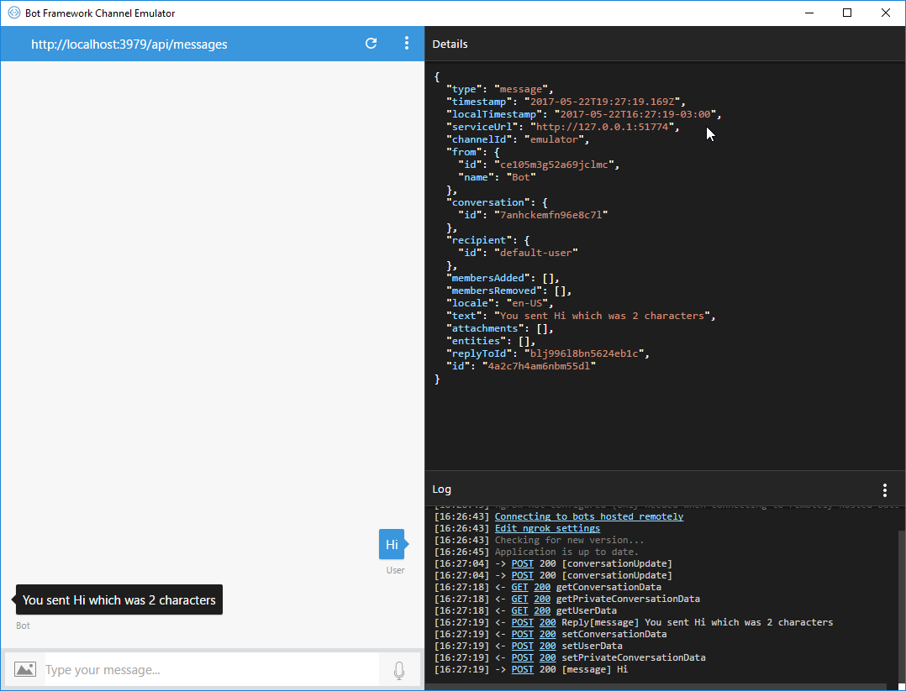

# Exercise 1: Creating Your First "Echo" Bot (Node.js)

## Introduction

This exercise will show you how to build a bot by using the Bot Builder SDK for Node.js and then test it with the Bot Framework Emulator.

Inside [this folder](./exercise1-EchoBot) you will find a solution with the code that results from completing the steps in this exercise. You can use this solutions as guidance if you need additional help as you work through this exercise. Remember that for using it, you first need to run `npm install`.

## Prerequisites

The following software is required for completing this exercise:

* [Latest Node.js with NPM](https://nodejs.org/en/download/)
* A code editor like [Visual Studio Code](https://code.visualstudio.com/download) or Visual Studio 2017 Community, Professional, or Enterprise

## Task 1: Initialize the App and Install the Bot Builder SDK

The Bot Builder SDK for Node.js is a powerful, easy-to-use framework that provides a familiar way for Node.js developers to write bots. It leverages frameworks like Express & Restify to provide a familiar way for JavaScript developers to write bots.

1. To install the Bot Builder SDK and its dependencies, first create a folder for your bot. Open a console window, navigate to it, and run the following npm command. Use `app.js` as your entry point, and leave the rest of the default answers.

    ```
    npm init
    ```

1. Next, install the Bot Builder SDK and [Restify](http://restify.com/) modules by running the following npm commands:

    ```
    npm install --save botbuilder
    npm install --save restify
    ```

    Please notice that the Bot Builder SDK is independent of the Web framework you use. This hands-on lab uses Restify, but you can use others like Express or Koa.

## Task 2: Create the Bot

1. Create an `app.js` file name and add the following code to the file. Notice that the bot will be listening in port 3978 by default using the Restify framework.

    The code below has three main sections:
     * Creating the chat connector using the ChatConnector class
     * Using the connector in an Restify route to listen for messages
     * Adding the code using the UniversalBot class to reply to the user

    The Bot Builder SDK for Node.js provides the UniversalBot and ChatConnector classes for configuring the bot to send and receive messages through the Bot Framework Connector. The UniversalBot class forms the brains of your bot. It's responsible for managing all the conversations your bot has with a user. The ChatConnector connects your bot to the Bot Framework Connector Service. The Connector also normalizes the messages that the bot sends to channels so that you can develop your bot in a platform-agnostic way.


    ```javascript
    const restify = require('restify');
    const builder = require('botbuilder');

    // Setup Restify Server
    var server = restify.createServer();
    server.listen(process.env.port || process.env.PORT || 3978, function () {
        console.log('%s listening to %s', server.name, server.url);
    });

    // Create chat connector for communicating with the Bot Framework Service
    var connector = new builder.ChatConnector({
        appId: process.env.MICROSOFT_APP_ID,
        appPassword: process.env.MICROSOFT_APP_PASSWORD
    });

    // Listen for messages from users
    server.post('/api/messages', connector.listen());

    // Receive messages from the user and respond by echoing each message back (prefixed with 'You said:')
    var bot = new builder.UniversalBot(connector, [
        function (session, args, next) {
            session.send('You said: ' + session.message.text + ' which was ' + session.message.text.length + ' characters');
        }
    ]);
    ```

## Task 3: Test the Bot

Next, test your bot by using the Bot Framework Emulator to see it in action. The emulator is a desktop application that lets you test and debug your bot on localhost or running remotely through a tunnel. The emulator displays messages as they would appear in a web chat UI and logs JSON requests and responses as you exchange messages with your bot.

1. First, you'll need to download and install the emulator. Browse [here](https://emulator.botframework.com/) to download it. After the download completes, launch the executable and complete the installation process.

1. After installing the emulator, start your bot in a console window by using the following command. At this point, your bot is running locally.

    ```
    node app.js
    ```

    > **NOTE:** If you get a Windows Firewall alert, click **Allow access**. Also, if you get an `EADDRINUSE` error, change the default port to 3979 or similar.

1. Next, start the emulator and then connect your bot. Type `http://localhost:3978/api/messages` into the address bar. This is the default endpoint that your bot listens to when hosted locally.

1. Click **Connect**. Because you are running your bot locally, you won't need to specify Microsoft App ID and Microsoft App Password. You can leave these fields blank for now. You'll get this information later when you register your bot in the Bot Framework Portal.

1. You should see that the bot responds to each message you send by echoing back your message prefixed with the text "You said" and ending in the text 'which was ## characters', where ## represents the number of characters in the user's message.

    