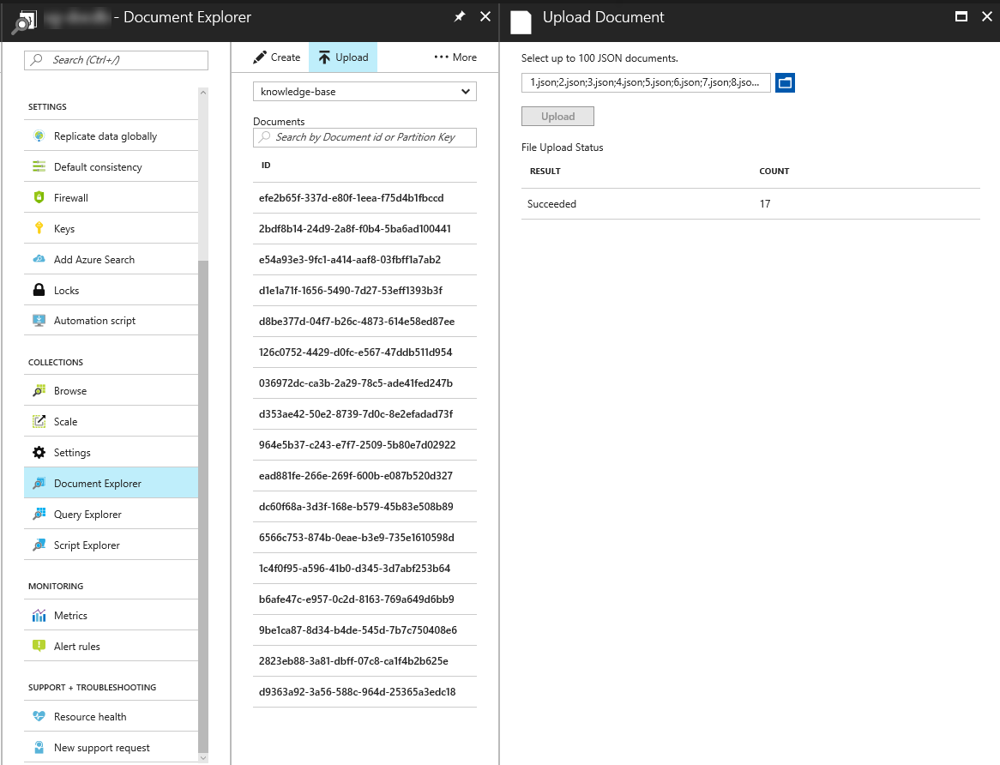
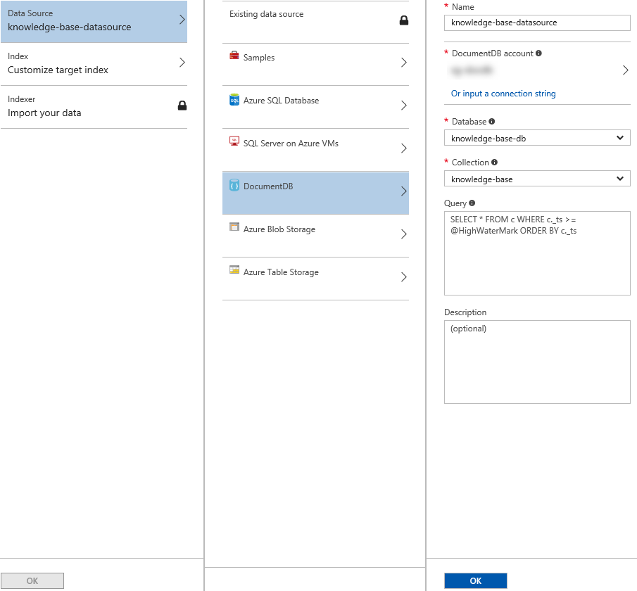
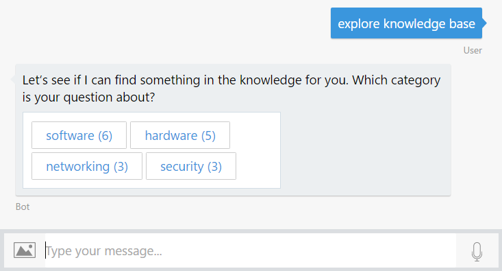
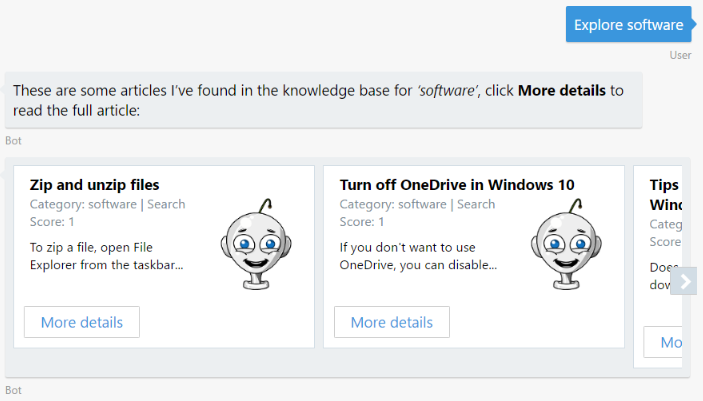

# Exercise 4: Implementing a Help Desk Knowledge Base with Azure Search and Cosmos DB (Node.js)

## Introduction

Your bots can also help the user navigate large amounts of content and create a data-driven exploration experience for users. In this exercise you will learn how to add search functionality to the bot to help users explore a knowledge base. To do this, you will connect the Bot to the Azure Search service that will index KB articles stored in an Azure Cosmos DB.

[Azure Cosmos DB](https://azure.microsoft.com/en-us/services/cosmos-db/) is Microsoft's globally distributed, multi-model database service for mission-critical applications. It supports different data models. In this exercise you will use its Document DB API, that will allow you to store knowledge base articles as JSON documents.

[Azure Search](https://azure.microsoft.com/en-us/services/search/) is a fully managed cloud search service that provides a rich search experience to custom applications. Azure Search can also index content from various sources (Azure SQL DB, Cosmos DB, Blob Storage, Table Storage), supports "push" indexing for other sources of data, and can open PDFs, Office documents and other formats containing unstructured data. The content catalog goes into an Azure Search index, which you can then query from bot dialogs.

> **NOTE:** While this lab uses Azure Search and Azure Cosmos DB, you can of course use any search engine and backing store you desire.

Inside [this folder](./exercise4-KnowledgeBase) you will find a solution with the code that results from completing the steps in this exercise. You can use this solutions as guidance if you need additional help as you work through this exercise. Remember that for using it, you first need to run `npm install` and complete the placeholders of the LUIS Model and Azure Search Index name and key.

## Prerequisites

The following software is required for completing this exercise:

* [Latest Node.js with NPM](https://nodejs.org/en/download)
* A code editor like [Visual Studio Code](https://code.visualstudio.com/download) (preferred), or Visual Studio 2017 Community or higher
* An [Azure](https://azureinfo.microsoft.com/us-freetrial.html?cr_cc=200744395&wt.mc_id=usdx_evan_events_reg_dev_0_iottour_0_0) subscription
* The [Bot Framework Emulator](https://emulator.botframework.com)
* An account in the [LUIS Portal](https://www.luis.ai)

## Task 1: Create a Cosmos DB Service and Upload the Knowledge Base

In this task you will create a Cosmos DB database and upload some documents that will be consumed by your bot. If you're unsure about how Azure Cosmos DB works, you can check the [documentation](https://docs.microsoft.com/en-us/azure/cosmos-db/).

1. Navigate to the [Azure portal](https://portal.azure.com) and sign in. Click on the **New** button () on the left bar, next on **Databases** and then choose **Azure Cosmos DB**.

1. In the dialog box, type a unique account ID (eg. _help-desk-bot_), select **SQL (DocumentDB)** as the *API*. Type a new resource group name and click **Create**.

    

1. Wait until the deployment finishes. Open the previously created *Cosmos DB account* and navigate to the **Overview** section. Click on the **Add Collection** button. In the dialog box, type _knowledge-base_ as the *Collection Id*, select **Fixed** as the storage capacity and type _knowledge-base-db_ as the *database name*. Click *OK*.

    

1. Select **Document Explorer** on the left, and next click on the **Upload** button.

1. On the opened window pick up all the files in the [assets/kb](../assets/kb) folder. Each one represents an article from the Knowledge base. Click **Upload**. Do not close the browser.

    

    > **NOTE:** Each article "document" has three fields: title, category and text.

## Task 2: Create an Azure Search Service

In this task you will create an Azure Search Service to index the content uploaded to Cosmos DB. Azure Search creates a indexed copy of the data, optimized for searching.

1. In the Azure Portal, click on **New** button () on the left bar, next on **Web + Mobile**, choose **Azure Search** and click on the **Create** button. Type a unique *URL* (eg. _help-desk-bot-search_). Choose the same resource group you have used for the Cosmos DB. Change the *Price Tier* to **Free** and click **Create**.

    

1. Once the service is provisioned, navigate to the *Overview* and then click on the **Import data** button ().

1. Click on the **Connect to your data** button and **DocumentDB** next. Type _knowledge-base-datasource_ on the data source *name*. Select the *Cosmos DB Account*, *Database* and *Collection* you just created. Click **OK**.

    

1. Click the **Index - Customize target index** button. Type _knowledge-base-index_ as Index Name. Update the check boxes in the columns so that the index definition matches the following image. Click **OK**.

    Notice that the category field is marked as Filterable and Facetable. This will allow you to retrieve all the articles that match a category, and also, retrieve the number of articles in each category. In Azure Search terminology, this is called _Faceted Navigation_. Faceted navigation is a powerful bot user experience tool for helping guide the user.

    

    > **NOTE:** For more information about Indexes, see [this article](https://docs.microsoft.com/en-us/azure/search/search-what-is-an-index).

1. Finally click the **Indexer - Import your data** button. Enter *knowledge-base-indexer* as *Name*. Ensure **Once** is selected as the *Schedule*. Click **OK**.

    

1. Click **OK** again to close the *Import Data* dialog.

1. Click on **Keys** on the left, and next click on **Manage query keys**. Save the default Azure Search key (identified by the **&lt;empty&gt;** name) for the next task.

    

    > **NOTE:** The Query key, unlike the Admin keys, can only be used to perform read-only operations on your Search indexes such as querying and looking up documents by ID. Your primary and secondary admin keys grant full rights to all operations, including the ability to manage the service, create and delete indexes, indexers, and data sources.

## Task 3: Update the LUIS Model to Include the ExploreKnowledgeBase Intent

In this task you will add a new Intent to LUIS to explore the Knowledge Base.

1. Sign in to the [LUIS Portal](https://www.luis.ai/). Edit the App you created on Exercise 3.

1. Click on **Intents** on the left menu and next click on the **Add Intent** button. Type _ExploreKnowledgeBase_ as the *Intent name* and then add the following utterances:

    * _explore knowledge base_
    * _explore hardware articles_
    * _find me articles about hardware_

    

1. Click **Save**.

1. Click on the **Publish App** link on the left. Click on the **Train** button and when it finishes, clicks the **Publish** button.

## Task 4: Update the Bot to call the Azure Search API

In this task you will add a dialog to handle the Intent you just created and call the *Azure Search* service.

1. Open the app you've obtained from the previous exercise. Alternatively, you can use the app from the [exercise3-LuisDialog](./exercise3-LuisDialog) folder. If you do so, edit the `.env` file and replace the **{LuisModelEndpointUrl}** placeholder with your model URL.

1. Add a new empty file named **azureSearchApiClient.js** and add the following code which will retrieve the data from *Azure Search* via its REST API.

    ```javascript
    const restify = require('restify');

    module.exports = (config) => {
        return (query, callback) => {
            const client = restify.createJsonClient({ url: `https://${config.searchName}.search.windows.net/` });
            var urlPath = `/indexes/${config.indexName}/docs?api-key=${config.searchKey}&api-version=2015-02-28&${query}`;

            client.get(urlPath, (err, request, response, result) => {
                if (!err && response && response.statusCode == 200) {
                    callback(null, result);
                } else {
                    callback(err, null);
                }
            });
        };
    };
    ```

1. Update the `.env` file adding the following lines. Replace the *{AzureSearchAccountName}* placeholder with the Azure Search acount name (eg. _help-desk-bot-search_) and the *{AzureSearchKey}* with the key value.

    ```javascript
    AZURE_SEARCH_ACCOUNT={AzureSearchAccountName}
    AZURE_SEARCH_INDEX=knowledge-base-index
    AZURE_SEARCH_KEY={AzureSearchKey}
    ```

1. In **app.js** add the following code in the upper section to instantiate the search client.

    ```javascript
    const azureSearch = require('./azureSearchApiClient');

    const azureSearchQuery = azureSearch({
        searchName: process.env.AZURE_SEARCH_ACCOUNT,
        indexName: process.env.AZURE_SEARCH_INDEX,
        searchKey: process.env.AZURE_SEARCH_KEY
    });
    ```

1. Add the *ExploreKnowledgeBase* dialog handler to retrieve articles for a category, just after the *SubmitTicket* dialog.

    ```javascript
    bot.dialog('ExploreKnowledgeBase', [
        (session, args) => {
            var category = builder.EntityRecognizer.findEntity(args.intent.entities, 'category');
            if (!category) {
                return session.endDialog('Try typing something like _explore hardware_.');
            }
            // search by category
            azureSearchQuery('$filter=' + encodeURIComponent(`category eq '${category.entity}'`), (error, result) => {
                if (error) {
                    console.log(error);
                    session.endDialog('Ooops! Something went wrong while contacting Azure Search. Please try again later.');
                } else {
                    var msg = `These are some articles I\'ve found in the knowledge base for the _'${category.entity}'_ category:`;
                    result.value.forEach((article) => {
                        msg += `\n * ${article.title}`;
                    });
                    session.endDialog(msg);
                }
            });
        }
    ]).triggerAction({
        matches: 'ExploreKnowledgeBase'
    });
    ```

## Task 5: Test your Bot at this Point

1. Run the app from a console (`nodemon app.js`) and open the emulator. Type the bot URL as usual (`http://localhost:3978/api/messages`).

1. Type *explore hardware*. Notice that the bot lists the articles within that *category*. You can also try with other categories values (networking, software, etc.).

    

## Task 6: Update the Bot to Display Categories and Articles

In this task you will update your bot code to explore the Knowledge Base by its categories.

1. In the **app.js**, add the following dialog to execute a simple search using the text typed by the user. In this case, the dialog is triggered by a regular expression that detects the _'search about'_ phrase in the user input. Notice that the `matches` method can take a regular expression or the name of a recognizer.

    ```javascript
    bot.dialog('SearchKB', [
        (session) => {
            session.sendTyping();
            azureSearchQuery(`search=${encodeURIComponent(session.message.text.substring('search about '.length))}`, (err, result) => {
                if (err) {
                    session.send('Ooops! Something went wrong while contacting Azure Search. Please try again later.');
                    return;
                }
                session.replaceDialog('ShowKBResults', { result, originalText: session.message.text });
            });
        }
    ])
    .triggerAction({
        matches: /^search about (.*)/i
    });
    ```

    > **NOTE:** In Azure Search, A `search=...` query searches for one or more terms in all searchable fields in your index, and works the way you would expect a search engine like Google or Bing to work. A `filter=...` query evaluates a boolean expression over all filterable fields in an index. Unlike search queries, filter queries match the exact contents of a field, which means they are case-sensitive for string fields.

1. Replace the **ExploreKnowledgeBase** dialog to retrieve the categories and list them. Notice that this is done by querying the index using the `facet=category` query. This will retrieve from the index all the possible "category filters" for all the articles (in this case, software, hardware, networking and so on). Also, Azure Search returns the number of articles in each facet.

    ```javascript
    bot.dialog('ExploreKnowledgeBase', [
        (session, args, next) => {
            var category = builder.EntityRecognizer.findEntity(args.intent.entities, 'category');

            if (!category) {
                // retrieve facets
                azureSearchQuery('facet=category', (error, result) => {
                    if (error) {
                        session.endDialog('Ooops! Something went wrong while contacting Azure Search. Please try again later.');
                    } else {
                        var choices = result['@search.facets'].category.map(item=> `${item.value} (${item.count})`);
                        builder.Prompts.choice(session, 'Let\'s see if I can find something in the knowledge base for you. Which category is your question about?', choices, { listStyle: builder.ListStyle.button });
                    }
                });
            } else {
                if (!session.dialogData.category) {
                    session.dialogData.category = category.entity;
                }

                next();
            }
        },
    ]).triggerAction({
        matches: 'ExploreKnowledgeBase'
    });
    ```

1. Add a second waterfall step to perform a search by article category using the `$filter=...` parameter.

    ```javascript
    (session, args) => {
        var category;

        if (session.dialogData.category) {
            category = session.dialogData.category;
        } else {
            category = args.response.entity.replace(/\s\([^)]*\)/,'');
        }

        // search by category
        azureSearchQuery('$filter=' + encodeURIComponent(`category eq '${category}'`), (error, result) => {
            if (error) {
                session.endDialog('Ooops! Something went wrong while contacting Azure Search. Please try again later.');
            } else {
                session.replaceDialog('ShowKBResults', { result, originalText: category });
            }
        });
    }
    ```

    > **NOTE:** The `session.replaceDialog()` method lets you end the current dialog and replace it with a new one without returning to the caller.

1. Add the following code at the end of the **app.js** file to add a **DetailsOf** dialog. This dialog retrieves a specific article based in its title - notice the `$filter='title eq ...'` query filter.

    ```javascript
    bot.dialog('DetailsOf', [
        (session, args) => {
            var title = session.message.text.substring('show me the article '.length);
            azureSearchQuery('$filter=' + encodeURIComponent(`title eq '${title}'`), (error, result) => {
                if (error || !result.value[0]) {
                    session.endDialog('Sorry, I could not find that article.');
                } else {
                    session.endDialog(result.value[0].text);
                }
            });
        }
    ]).triggerAction({
        matches: /^show me the article (.*)/i
    });
    ```

    > **NOTE:** For simplicity purposes, the article content is retrieved directly from Azure Search. However, in a production scenario, Azure Search would only work as the index and the full article would be retrieved from Cosmos DB.

1. Add the following dialog to handle the **ShowKBResults** dialog. This dialog presents a list of article results to the user using a carousel of HeroCards. A card that typically contains a single large image, one or more buttons, and text. For more information about how to show rich cards to users see [this article](https://docs.microsoft.com/en-us/bot-framework/nodejs/bot-builder-nodejs-send-rich-cards).

    ```javascript
    bot.dialog('ShowKBResults', [
        (session, args) => {
            if (args.result.value.length > 0) {
                var msg = new builder.Message(session).attachmentLayout(builder.AttachmentLayout.carousel);
                args.result.value.forEach((faq, i) => {
                    msg.addAttachment(
                        new builder.HeroCard(session)
                            .title(faq.title)
                            .subtitle(`Category: ${faq.category} | Search Score: ${faq['@search.score']}`)
                            .text(faq.text.substring(0, Math.min(faq.text.length, 50) + '...'))
                            .buttons([{ title: 'More details', value: `show me the article ${faq.title}`, type: 'postBack' }])
                    );
                });
                session.send(`These are some articles I\'ve found in the knowledge base for _'${args.originalText}'_, click **More details** to read the full article:`);
                session.endDialog(msg);
            } else {
                session.endDialog(`Sorry, I could not find any results in the knowledge base for _'${args.originalText}'_`);
            }
        }
    ]);
    ```

    > **NOTE:** The PostBack action type will post a message to bot privately, so other participants inside conversation will not see that was posted.

1. Finally, update the text in the `Help` dialog to include the knowledge base functionality.

    ```javascript
    bot.dialog('Help',
        (session, args, next) => {
            session.endDialog(`I'm the help desk bot and I can help you create a ticket or explore the knowledge base.\n` +
                `You can tell me things like _I need to reset my password_ or _explore hardware articles_.`);
        }
    ).triggerAction({
        matches: 'Help'
    });
    ```

## Task 7: Test the Bot from the Emulator

1. Run the app from a console (`nodemon app.js`) and open the emulator. Type the bot URL as usual (`http://localhost:3978/api/messages`).

1. Type `explore knowledge base`. You should get a list of the article categories you uploaded to Cosmos DB, with the number of articles in each category.

    

1. Click on any of the categories listed and you should see the articles for that category.

    

1. Click the **More details** button of an article and you should see the full article text.

    

1. You can try to explore a specific category. Type `explore software articles` and you should see some articles within that category.

    

1. You can try to search for articles about one topic as well. For example type `search about OneDrive`.

    

    > **NOTE:** Notice that the search returns the score of each document returned.
