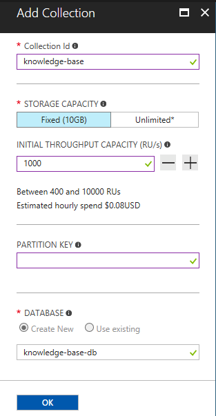
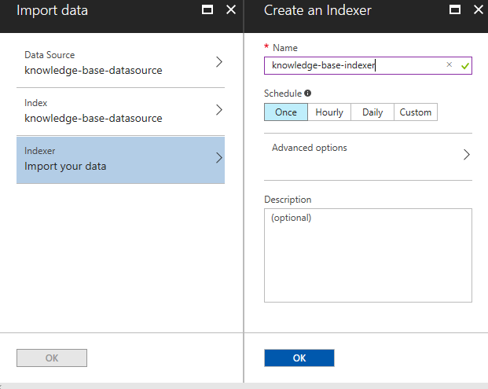
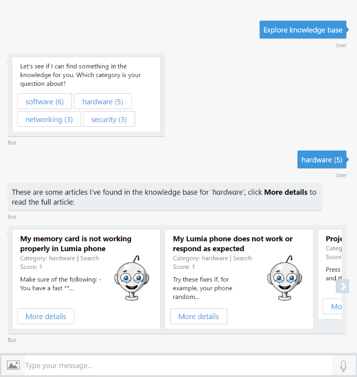
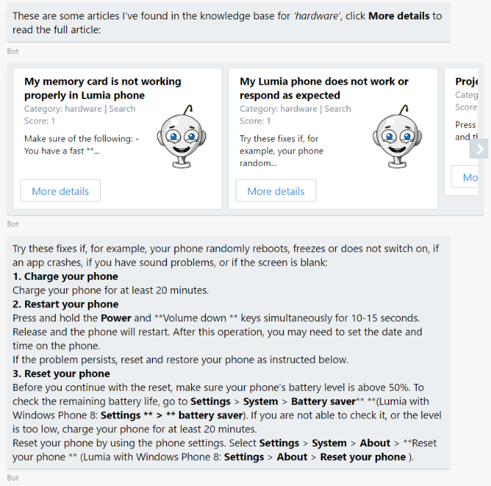
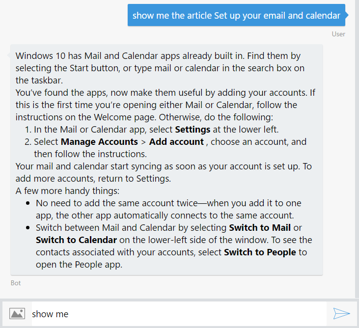

# Exercise 4: Implementing a Help Desk Knowledge Base with Azure Search and Cosmos DB (Node.js)

## Introduction

In this exercise you will learn how to add search functionality to the bot to help users explore a knowledge base. To do this, you will connect the Bot to the Azure Search service that will index articles stored in an Azure Cosmos DB.

[Azure Cosmos DB](https://azure.microsoft.com/en-us/services/cosmos-db/) is Microsoft's globally distributed, multi-model database service for mission-critical applications. It supports different data models. In this exercise you will use its Document DB API, that will allow you to store knowledge base articles as JSON documents.

[Azure Search](https://azure.microsoft.com/en-us/services/search/)  is a fully managed cloud search service that provides a rich search experience to custom applications. Azure Search can also index content from various sources (Azure SQL DB, Cosmos DB, Blob Storage, Table Storage), supports "push" indexing for other sources of data, and can open PDFs, Office documents and other formats containing unstructured data. The content catalog goes into an Azure Search index, which you can then query from bot dialogs.

Inside [this folder](./exercise4-KnowledgeBase) you will find a solution with the code that results from completing the steps in this exercise. You can use this solutions as guidance if you need additional help as you work through this exercise. Remember that for using it, you first need to run `npm install`.

## Prerequisites

The following software is required for completing this exercise:

* [Latest Node.js with NPM](https://nodejs.org/en/download/)
* A code editor like [Visual Studio Code](https://code.visualstudio.com/download) or Visual Studio 2017 Community, Professional, or Enterprise
* An Azure Subscription - you can sign up for a free trial [here](https://azureinfo.microsoft.com/us-freetrial.html?cr_cc=200744395&wt.mc_id=usdx_evan_events_reg_dev_0_iottour_0_0)
* Creating an account in the LUIS Portal [here](https://www.luis.ai)
* The Bot Framework Emulator - download it from [here](https://emulator.botframework.com/)

## Task 1: Create a Cosmos DB Service and Upload the Knowledge Base

In this task you will create a Cosmos DB database and upload some documents that will be consumed by your bot. You can learn more about Cosmos DB Concepts [here]( https://docs.microsoft.com/en-us/azure/documentdb/documentdb-resources).

1. Navigate to the [Azure portal](https://portal.azure.com) and sign in. Click on the **New** button on the left bar, next on *Databases* and then choose **Azure Cosmos DB**. Click the *Create* button.

1. In the dialog box, type a uniquie account ID and ensure **SQL (DocumentDB)** is selected as the *API*. Click on *Create*.

    

1. Open the previously created *Cosmos DB account* and navigate to the *Overview* section. Click on the *Add Collection* button. In the dialog box, type **knowledge-base** as the *Collection Id* and **knowledge-base-db** on *new Database*. Click on the *OK* button.

    

1. Click on the *Document Explorer* on the left, and next click on the *Upload* button.

1. On the opened window pick up all the files in the [assets/kb](../assets/kb) folder. Click on the **Upload** button. 

    


    > **NOTE:** Each article "document" has three fields: title, category and text.

## Task 2: Create an Azure Search Service

In this task you will create an Azure Search Service related with the Cosmos DB created in the previous task.

1. Sign in to [Azure portal](https://portal.azure.com) if you aren't there already. Click on **New** button on the left bar, next on *Web + Mobile* and then choose *Azure Search* and click on the *Create* button. Type the service name on the *URL*. Ensure you have selected a *Subscription*, *Resource Group*, *Location* and *Price Tier* and click on the **Create** button.

    

1. Navigate to the *Overview* and then click on the *Data Source - Import data* button.

1. Click on the *Connect to your data* button and *DocumentDB* next. Enter **knowledge-base-datasource** on the data source *name*. Select the *DocumentDB Account*, the *Database* and *Collection*  with the one you just created. Click **Ok**.

    

1. Click on the **Index - Customize target index** button. Type _knowledge-base-index_ as Index Name. Ensure the index definition matches the following screenshot. Click *Ok*. 

    Notice that the category field is marked as Facetable. This will allow you later to retrieve all the articles by Category. In Azure Search terminology, this is called _Faceted Navigation_.

    


1. Click on the **Indexer - Import your data** button. Enter **knowledge-base-indexer** as *Name*. Ensure **Once** is selected in the *Schedule*. Click *OK*.

    

1. Click **OK** again to close the *Import Data* dialog.

1. Click on **Settings\Keys** on the left. And next Click on **Manage query keys**. Save the default **Azure Search key** (identified by the *&lt;empty&gt;* name) for future usage.

    

## Task 3: Update the LUIS Model to Include the ExploreKnowledgeBase Intent

In this task you will add a new Intent to LUIS to explore the Knowledge Base.

1. Sign in on the [LUIS Portal](https://www.luis.ai/). Edit the App you created on Exercise 3.

1. Click on **Intents** on the left menu and next click on the **Add Intent** button. Type **ExploreKnowledgeBase** as the *Intent name* and then add the following utterances:
    
    * explore knowledge base
    * explore hardware
    * find me articles about hardware

1. Click **Save**.

1. Click on the **Publish App** link on the left. Click on the **Train** button and when it finishes, click on the **Publish** button.

## Task 4: Update the Bot to call the Azure Search API

In this task you will add a dialog which will handle the Intent you just created and call the *Azure Search* service.

1. Open the **app.js** file you've obtained from the previous exercise. Alternatively, you can use the app from the [exercise3-LuisDialog](./exercise3-LuisDialog) folder.

1. Add a new empty file named **azureSearchApiClient.js** and paste the following code which will retrieve the data from *Azure Search* via its REST API.
    
    ```javascript
    const restify = require('restify');
    
    module.exports = (config) => {
        return (query, callback) => {
            const client = restify.createJsonClient({ url: `https://${config.searchName}.search.windows.net/` });
            var urlPath = `/indexes/${config.indexName}/docs?api-key=${config.searchKey}&api-version=2015-02-28&${query}`;

            client.get(urlPath, (err, request, response, result) => {
                if (!err && response && response.statusCode == 200) {
                    callback(null, result);
                } else {
                    callback(err, null);
                }
            });
        };
    };
    ```

1. In **app.js** add the following code in the upper section to instantiate the search client. Replace the *{AzureSearchAccountName}* placeholder with the Azure Search acount name and the *{AzureSearchKey}* with the key value.

    ```javascript
    const azureSearch = require('./azureSearchApiClient');

    const azureSearchQuery = azureSearch({
        searchName: process.env.AZURE_SEARCH_ACCOUNT || '{AzureSearchAccountName}',
        indexName: process.env.AZURE_SEARCH_INDEX || 'knowledge-base-index',
        searchKey: process.env.AZURE_SEARCH_KEY || '{AzureSearchKey}'
    });
    ```

1. Add the *ExploreKnowledgeBase* dialog handler to retrieve articles for a category, just after the *SubmitTicket* dialog.
    
    ```javascript
    bot.dialog('ExploreKnowledgeBase', [
        (session, args) => {
            var category = builder.EntityRecognizer.findEntity(args.intent.entities, 'category');
            if (!category) {
                return session.endDialog('Try typing something like _explore hardware_.');
            }
            // search by category
            azureSearchQuery('$filter=' + encodeURIComponent(`category eq '${category.entity}'`), (error, result) => {
                if (error) {
                    session.endDialog('Ooops! Something went wrong while contacting Azure Search. Please try again later.');
                } else {
                    var msg = `These are some articles I\'ve found in the knowledge base for the _'${category.entity}'_ category:`;
                    result.value.forEach((article) => {
                        msg += `\n * ${article.title}`;
                    });
                    session.endDialog(msg);
                }
            });
        }
    ]).triggerAction({
        matches: 'ExploreKnowledgeBase'
    });
    ```

## Task 5: Test your Bot at this Point

1. Run the app from a console (`node app.js`) and open the emulator. Type the bot URL as usual (`http://localhost:3978/api/messages`).

1. Type *explore hardware*. Notice the list of articles with that *category* shown by your bot. You can also try with the remaining categories values you upload as LUIS entity list.

    

## Task 6: Update the Bot to Display Categories (Facets) and Articles

In this task you will update your bot code to explore the Knowledge Base starting by its categories or requesting a specific category or article.

// TODO: add info about Facets

1. In the **app.js**, update the default dialog to perform a search.

    ```javascript
    var bot = new builder.UniversalBot(connector, (session) => {
        session.sendTyping();
        azureSearchQuery(`search=${encodeURIComponent(session.message.text)}`, (err, result) => {
            if (err) {
                session.send('Ooops! Something went wrong on my side, please try again later.');
                return;
            }
            session.replaceDialog('ShowKBResults', { result, originalText: session.message.text });
        });
    });
    ```
    
    > **NOTE:** In Azure Search, A `search=...` query searches for one or more terms in all searchable fields in your index, and works the way you would expect a search engine like Google or Bing to work. A `filter=...` query evaluates a boolean expression over all filterable fields in an index. Unlike search queries, filter queries match the exact contents of a field, which means they are case-sensitive for string fields.

1. Add as the first step of the waterfall in **ExploreKnowledgeBase** dialog the next code that retrieve the facets when the user doesn't provide a category in the intent and when the category is present it pass to the next step.

    ```javascript
    (session, args, next) => {
        var category = builder.EntityRecognizer.findEntity(args.intent.entities, 'category');

        if (!category) {
            // retrieve facets
            azureSearchQuery('facet=category', (error, result) => {
                if (error) {
                    session.endDialog('Ooops! Something went wrong while contacting Azure Search. Please try again later.');
                } else {
                    var choices = result['@search.facets'].category.map(item=> `${item.value} (${item.count})`);
                    builder.Prompts.choice(session, 'Let\'s see if I can find something in the knowledge for you. Which category is your question about?', choices, { listStyle: builder.ListStyle.button });
                }
            });
        } else {
            if (!session.dialogData.category) {
                session.dialogData.category = category.entity;
            }

            next();
        }
    },
    ```

1. Update the second waterfall step to take care about the stored data when the user sends a category.

    ```javascript
    (session, args) => {
        var category;

        if (session.dialogData.category) {
            category = session.dialogData.category;
        } else {
            category = args.response.entity.replace(/\s\([^)]*\)/,'');
        }

        // search by category
        azureSearchQuery('$filter=' + encodeURIComponent(`category eq '${category}'`), (error, result) => {
            if (error) {
                session.endDialog('Ooops! Something went wrong while contacting Azure Search. Please try again later.');
            } else {
                session.replaceDialog('ShowKBResults', { result, originalText: category });
            }
        });
    }
    ```

1. Add the following code at the end of the **app.js** file that add a **DetailsOf** dialog. This dialog retrieves an specific article based in its title. It is triggered by a regular expression that detects the _'show me the article'_ phrase in the user input.

    ```javascript
    bot.dialog('DetailsOf', [
        (session, args) => {
            var title = session.message.text.substring('show me the article '.length);
            azureSearchQuery('$filter=' + encodeURIComponent(`title eq '${title}'`), (error, result) => {
                if (error || !result.value[0]) {
                    session.endDialog('Sorry, I could not find that article.');
                } else {
                    session.endDialog(result.value[0].text);
                }
            });
        }
    ]).triggerAction({
        matches: /^show me the article (.*)/i
    });
    ```
    > **NOTE:** For simplicity purposes, the article content is  retrieved from Azure Search. However, in a production scenario, Azure Search would only work as the index and the full article would be retrieved from Cosmos DB.

1. Add the following code to handle the **ShowKBResults** dialog. This one presents the search results to the user.

    ```javascript
    bot.dialog('ShowKBResults', [
        (session, args) => {
            if (args.result.value.length > 0) {
                var msg = new builder.Message(session).attachmentLayout(builder.AttachmentLayout.carousel);
                args.result.value.forEach((faq, i) => {
                    msg.addAttachment(
                        new builder.HeroCard(session)
                            .title(faq.title)
                            .subtitle(`Category: ${faq.category} | Search Score: ${faq['@search.score']}`)
                            .text(faq.text.substring(0, Math.min(faq.text.length, 50) + '...'))
                            .buttons([{ title: 'More details', value: `show me the article ${faq.title}`, type: 'postBack' }])
                    );
                });
                session.send(`These are some articles I\'ve found in the knowledge base for _'${args.originalText}'_, click **More details** to read the full article:`);
                session.endDialog(msg);
            } else {
                session.endDialog(`Sorry, I could not find any results in the knowledge base for _'${args.originalText}'_`);
            }
        }
    ]);
    ```

## Task 7: Test the Bot from the Emulator

1. Run the app from a console (`node app.js`) and open the emulator. Type the bot URL as usual (`http://localhost:3978/api/messages`).

1. Type `explore knowledge base`. You should get a list of the article categories you uploaded to Cosmos DB. 

    

1. Click on any of the categories listed and you may see the articles for that category. 

    

1. Click the **More details** button of an article and you should see the full article text.

    

1. You can try to explore a specific category. Type `explore software` and youshouldmay see the articles within that category.

    

1. You can try to show a specific category too. Type `show me the article Turn on device encryption` and you may see the requested article (please note the search is case sensitive).

    