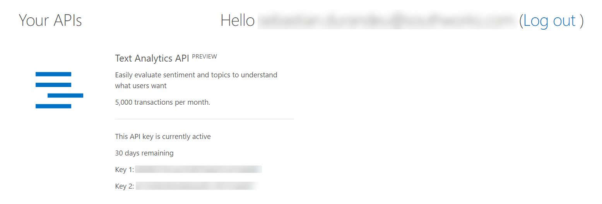
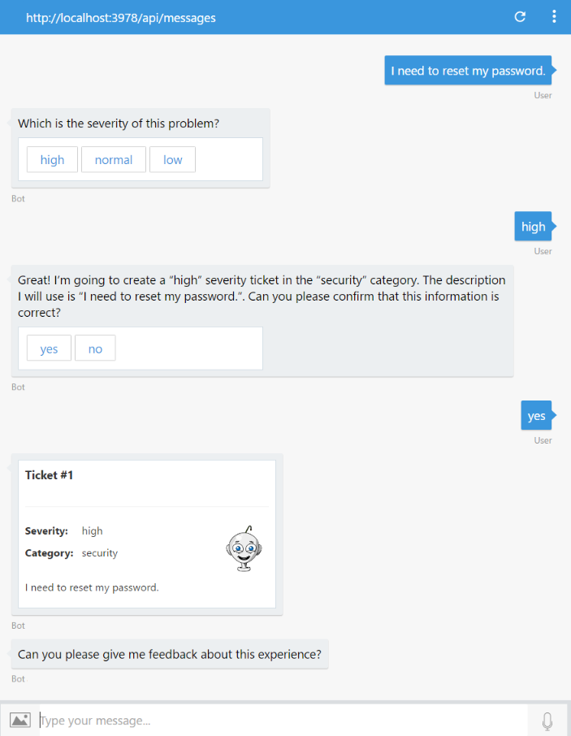

# Exercise 6: Determine the Sentiments Behind a User's Message (Node.js)

## Introduction

The interaction between users and bots is mostly free-form, so bots need to understand language naturally and contextually. In this exercise you will learn how to detect the user's sentiments and mood using the Azure Text Analytics API. 

With [Text Analytics APIs](https://azure.microsoft.com/en-us/services/cognitive-services/text-analytics/), part of the Azure Cognitive Services offering, you can  detect sentiment, key phrases, topics, and language from your text. The API returns a numeric score between 0 and 1. Scores close to 1 indicate positive sentiment and scores close to 0 indicate negative sentiment. Sentiment score is generated using classification techniques.

Inside [this folder](./exercise6-MoodDetection) you will find a solution with the code that results from completing the steps in this exercise. You can use this solutions as guidance if you need additional help as you work through this exercise. Remember that for using it, you first need to run `npm install` and complete the placeholders of the Text Analytics key.

## Prerequisites

The following software is required for completing this exercise:

* [Latest Node.js with NPM](https://nodejs.org/en/download/)
* A code editor like [Visual Studio Code](https://code.visualstudio.com/download) or Visual Studio 2017 Community, Professional, or Enterprise
* An Azure Subscription - you can sign up for a free trial [here](https://azureinfo.microsoft.com/us-freetrial.html?cr_cc=200744395&wt.mc_id=usdx_evan_events_reg_dev_0_iottour_0_0)
* The Bot Framework Emulator - download it from [here](https://emulator.botframework.com/)

## Task 1: Create the Text Analytics API Key

In this task you will create a Text Analytics Account.

1. Browse [here](https://azure.microsoft.com/en-us/try/cognitive-services/), select the **Language** tab. Find the *Text Analytics API* and click **Create**. You will be prompted to agree the terms of use and choose your country, next click **Next**. 


1. Log in with your Azure Subscription account. You should be taken to a page like the following one with an evaluation key with 5000 free requests. Save Key 1 for later use.

    

## Task 2: Add the Text Analytics API Client

In this task you will create a new module to call the Text Analytics API from the bot.

1. Open the app you've obtained from the previous exercise. Alternatively, you can use the app from the [exercise4-LuisDialog](./exercise4-KnowledgeBase) folder. If you do so, replace the **{LuisModelEndpointUrl}** placeholder with your model URL.

1. Create a new file named `textAnalyticsApiClient.js` and add the following code to it.

    > **NOTE:** Notice that the client is hitting the `/sentiment` endpoint. The Text Analytics API also provides the `/keyPhrases` and `/languages` endpoints. Also notice that you can send more than one document to analyze.

    ```javascript
    const restify = require('restify');

    module.exports = (config) => {
        return (query, callback) => {
            const client = restify.createJsonClient({
                url: `https://westus.api.cognitive.microsoft.com`,
                headers: {
                    'Ocp-Apim-Subscription-Key': config.apiKey
                }
            });

            const payload = {
                documents: [{
                    language: 'en',
                    id: 'singleId',
                    text: query
                }]
            };

            const urlPath = '/text/analytics/v2.0/sentiment';

            client.post(urlPath, payload, (err, request, response, result) => {
                if (!err &&
                    response &&
                    response.statusCode == 200 &&
                    result.documents[0]) {
                    callback(null, result.documents[0].score);
                } else {
                    callback(err, null);
                }
            });
        };
    };
    ```

## Task 3: Modify the Bot to Ask for Feedback and Analyze the User's Sentiments

In this task you will introduce the new Text Analytics module and then consume it from a new dialog on your bot.

1. Open the **app.js** file.

1. Add the following code.

    ```javascript
    const textAnalytics = require('./textAnalyticsApiClient');
    ```

1. Add the following code. Replace the *{TextAnalyticsKey}* placeholder with the *Text Analytics Key* you have obtained in Task 1.

    ```javascript
    const analyzeText = textAnalytics({
        apiKey: process.env.TEXT_ANALYTICS_KEY || '{TextAnalyticsKey}'
    });    
    ```

1. At the end of the file, add the following code that creates a new dialog to ask the user for feedback and call the *Text Analytics API* client to evaluate the user sentiments. Depending on the response (greater or lower than 0.5) a different message is displayed to the user.

    ```javascript
    bot.dialog('UserFeedbackRequest', [
        (session, args) => {
            builder.Prompts.text(session, 'Can you please give me feedback about this experience?');
        },
        (session, response) => {
            const answer = session.message.text;
            analyzeText(answer, (err, score) => {
                if (err) {
                    session.endDialog('Ooops! Something went wrong while analzying your answer. An IT representative agent will get in touch with you to follow up soon.');
                } else {
                    // 1 - positive feeling / 0 - negative feeling
                    if (score < 0.5) {
                        session.endDialog('I understand that you might be dissatisfied with my assistance. An IT representative will get in touch with you soon to help you.');
                    } else {
                        session.endDialog('Thanks for sharing your experience.');
                    }
                }
            });
        }
    ]);
    ```
    > **NOTE:** For sentiment analysis, it's recommended that you split text into sentences. This generally leads to higher precision in sentiment predictions.

1. Update the last waterfall step for the **SubmitTicket** dialog. Replace the `session.endDialog();` in the following code:

    ```javascript
    (session, result, next) => {
        if (result.response) {
            ...

            client.post('/api/tickets', data, (err, request, response, ticketId) => {
                ...

                session.endDialog();
            });
        } else {
          ...
        }
    }
    ```
    
    with the this code, which calls the `UserFeedbackRequest` dialog.

    ```javascript
    session.replaceDialog('UserFeedbackRequest');
    ```

## Task 3: Test the Bot from the Emulator

1. Run the app from a console (`node app.js`) and open the emulator. Type the bot URL as usual (`http://localhost:3978/api/messages`).

1. Type `I need to reset my password` and next choose a severity. Confirm the ticket submission, and check the new request for feedback.

    

1. Type `It was very useful and quick`. You should see the following response, which means it was a positive feedback.

    

1. Repeat the ticket submission and when the bot asks for feedback, type `it was useless and time wasting`. You should see a response as follows, which means it was a a negative feedback.

     

    In the next exercise (7) you will learn how to hand-off the conversation to a human so he can assist the user.

## Further Challenges

If you want to continue working on your own you can try with these tasks:

* You can add Speech Recognition to the bot by using another Microsoft Cognitive Services. You can try the [Bing Speech API](https://azure.microsoft.com/en-us/services/cognitive-services/speech/).
