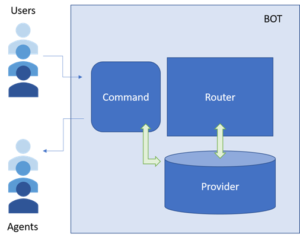
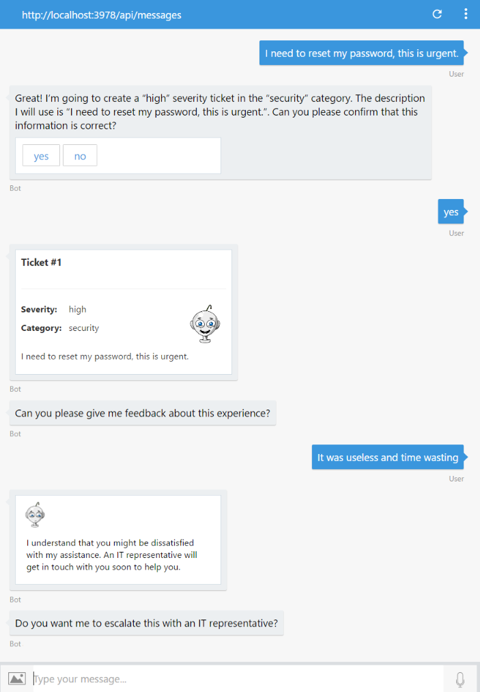
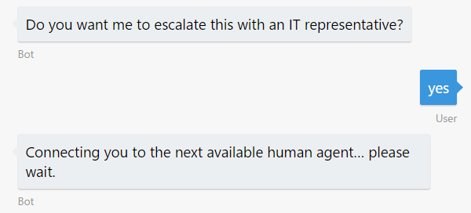
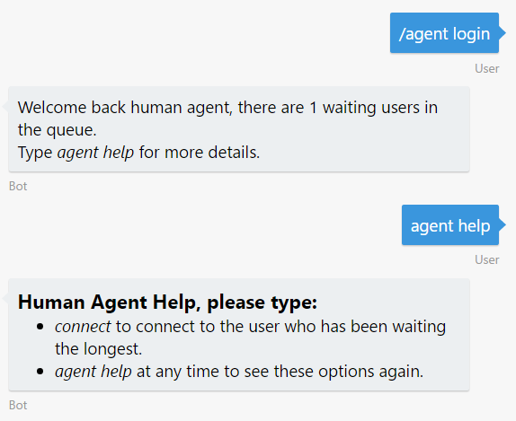
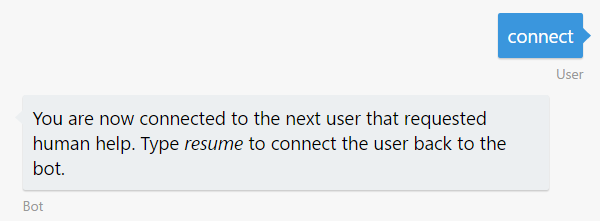
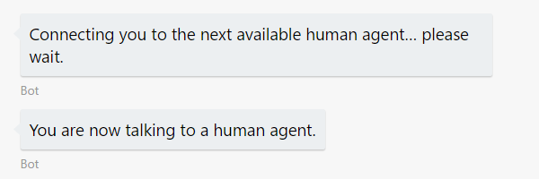
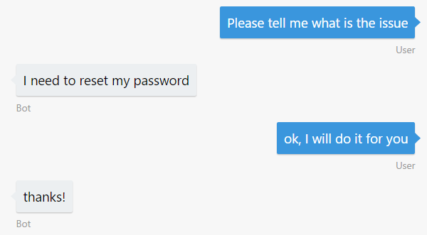
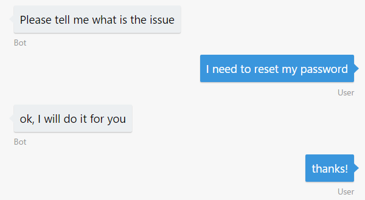
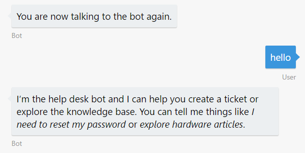

# Exercise 7: Hand off the Conversation to a Human Agent (Node.js)

## Introduction

Regardless of how much artificial intelligence a bot possesses, there may still be times when it needs to hand off the conversation to a human being. For example you want to build a bot that automatically replies some questions and is able to meet your customers wherever they are, but still be able to escalate issues to a human. Or if the bot couldn't handle every situation, or there were edge cases, the bot should be able to pass off to a person who had the right authority. The bot should recognize when it needs to hand off and provide the user with a clear, smooth transition. In this exercise, you will learn how you can use a bot to initiate a conversation with a user, and then hand off context to a human agent.

First, you will learn how to create a middleware to intercepts incoming and outgoing events/messages. In this middleware you will handle the user-agent communication and the specials command only available for agents. Later you will modify your bot to use the new middleware and add a dialog to hand off the bot conversation to a human agent.

Inside [this folder](./exercise7-HandOffToHuman) you will find a solution with the code that results from completing the steps in this exercise. You can use this solution as guidance if you need additional help as you work through this exercise. Remember that for using it, you need to run `npm install` and complete the placeholders for the LUIS Model, Azure Search Index name and key and Text Analytics key.

For more details about the hand-off approach used in this exercise you can check this session from [BUILD 2017](https://channel9.msdn.com/Events/Build/2017/P4075).

This diagram outlines the components of the bot for this exercise:



## Prerequisites

The following software is required for completing this exercise:

* [Latest Node.js with NPM](https://nodejs.org/en/download)
* A code editor like [Visual Studio Code](https://code.visualstudio.com/download) (preferred), or Visual Studio 2017 Community or higher
* An [Azure](https://azureinfo.microsoft.com/us-freetrial.html?cr_cc=200744395&wt.mc_id=usdx_evan_events_reg_dev_0_iottour_0_0) subscription
* The [Bot Framework Emulator](https://emulator.botframework.com)
* An account in the [LUIS Portal](https://www.luis.ai)

## Task 1: Build the Hand Off Logic

In this task you will add the necessary _behind-the-scene_ logic to handle the bridged communication between two persons, one as a user and other as an agent. You will learn how to create and put a middleware to intercept incoming and outgoing events/messages.

The middleware functionality in the Bot Builder SDK for Node.js enables your bot to intercept all messages that are exchanged between the user and the bot. For each message that is intercepted, you may choose to do things such as save the message to a data store that you specify, which creates a conversation log, or inspect the message in some way and take whatever action your code specifies. For more information about middlewares refer to [this link](https://docs.microsoft.com/en-us/bot-framework/nodejs/bot-builder-nodejs-intercept-messages).

1. Open the app you've obtained from the previous exercise. Alternatively, you can use the app from the [exercise6-MoodDetection](./exercise6-MoodDetection) folder.

    > **NOTE:** If you use the solution provided remember to replace:
    > * the **{LuisModelEndpointUrl}** placeholder with your model URL
    > * the **{textAnalyticsKey}** with your Text Analytics Key (as explained in exercise 6)
    > * the **{searchIndexName}** and **{searchIndexKey}** with your search index name and key (as explained in exercise 4)

1. Copy the folder [handoff](../assets/handoff) from the assets folder to the app. Inside you will find two files:

    * [`provider.js`](../assets/handoff/provider.js) which builds a queue with the users waiting for a human agent. Notice that this module does not persist the queue in an external storage. This is also where the conversations metadata is stored.

    * [`command.js`](../assets/handoff/command.js) to handle the special interaction between the agent and the bot to peek a waiting user to talk or to resume a conversation. This module has a [middleware](../assets/handoff/command.js#L9) that intercepts messages from human agents and route them to the options to connect or resume communications with users.

1. Create the `router.js` file in the handoff folder also, using the following code boilerplate. The router will be in charge of knowing each message needs to be sent to, either to the agent or the user.

    ```javascript
    const builder = require('botbuilder');
    const { Provider, ConversationState } = require('./provider');

    function Router(bot, isAgent) {
        'use strict';

        const provider = new Provider();

        const pending = () => {
            return provider.currentConversations().filter((conv) => conv.state === ConversationState.WaitingForAgent).length;
        };

        return {
            isAgent,
            middleware,
            pending,
            provider,
            bot
        };
    }

    module.exports = Router;
    ```

1. Add a `middleware` method in `router.js`. This method decides if it should route the incoming message to be handled as a human agent message or a normal user message.

    ```javascript
    const middleware = () => {
        return {
            botbuilder: (session, next) => {
                if (session.message.type === 'message') {
                    if (isAgent(session)) {
                        routeAgentMessage(session);
                    } else {
                        routeUserMessage(session, next);
                    }
                } else {
                    next();
                }
            }
        };
    };
    ```

1. Add `routeAgentMessage` method in `router.js`. This method routes the message from the human agent to the user if the agent is in conversation.

    ```javascript
    const routeAgentMessage = (session) => {
        const message = session.message;
        const conversation = provider.findByAgentId(message.address.conversation.id);

        if (!conversation) {
            return;
        }

        bot.send(new builder.Message().address(conversation.user).text(message.text));
    };
    ```

1. Add `routeUserMessage` method in `router.js`. This method is one of the most important in the hand-off logic. If the incoming message is from a normal user, this method retrieves (or create) the conversation's info and use the `conversation.state` to decides if it continues the normal bot flow, send a message to the user informing the status of the queue or route the user's message to the human agent.

    ```javascript
    const routeUserMessage = (session, next) => {
        const message = session.message;

        const conversation = provider.findByConversationId(message.address.conversation.id) || provider.createConversation(message.address);

        switch (conversation.state) {
            case ConversationState.ConnectedToBot:
                return next();
            case ConversationState.WaitingForAgent:
                session.send(`Connecting you to the next available human agent... please wait, there are ${pending()-1} users waiting.`);
                return;
            case ConversationState.ConnectedToAgent:
                bot.send(new builder.Message().address(conversation.agent).text(message.text));
                return;
        }
    };
    ```

Now, you have the modules in place to support the user-to-agent communication.

## Task 2: Update the Bot to Hand off the Conversation

In this task you will update the bot to connect to the routing middlewares you created and add the necessary dialogs to handle the handoff conversation flow.

1. Navigate to the [LUIS Portal](https://www.luis.ai) and edit your app to add **HandOffToHuman** intent with the following utterances:
    * _I want to talk to an IT representative_
    * _Contact me to a human being_

> **NOTE:** If you are already familiar with LUIS, you can import the file `luis_model.json` located under the [data](./exercise7-HandOffToHuman/data) folder of this exercise into your account, train and publish the model and continue on task 3. However, if you are new to LUIS, we recommend you work through creating the model from scratch for learning purposes.

1. Train and Publish your app again.

1. Open the **app.js** file. Add the following require statements at the top of the file.

    ```javascript
    const HandOffRouter = require('./handoff/router');
    const HandOffCommand = require('./handoff/command');
    ```

1. Add code to create the middleware as follows.

    ```javascript
    const handOffRouter = new HandOffRouter(bot, (session) => {
        return session.conversationData.isAgent;
    });
    const handOffCommand = new HandOffCommand(handOffRouter);
    ```

1. Connect each middleware to the bot by using `bot.use(...)`.

    ```javascript
    bot.use(handOffCommand.middleware());
    bot.use(handOffRouter.middleware());
    ```

1. Add the `AgentMenu` dialog to convert a user to a human agent. This is where the human agent is recognized as such by the bot (agent recognition) using the `isAgent` variable in the `conversationData`.

    ```javascript
    bot.dialog('AgentMenu', [
        (session, args) => {
            session.conversationData.isAgent = true;
            session.endDialog(`Welcome back human agent, there are ${handOffRouter.pending()} waiting users in the queue.\n\nType _agent help_ for more details.`);
        }
    ]).triggerAction({
        matches: /^\/agent login/
    });
    ```

    > **NOTE:** For simplicity purposes, the current way to register an agent does not include any protection or authentication. This should be refactored in a production bot to avoid normal users to connect as agents.

1. Add the dialog to put the user in the queue to talk to an agent.

    ```javascript
    bot.dialog('HandOff',
        (session, args, next) => {
            if (handOffCommand.queueMe(session)) {
                var waitingPeople = handOffRouter.pending() > 1 ? `, there are ${handOffRouter.pending()-1} people waiting` : '';
                session.send(`Connecting you to the next available human agent... please wait${waitingPeople}.`);
            }
            session.endDialog();
        }
    ).triggerAction({
        matches: 'HandOffToHuman'
    });
    ```

1. Update the `UserFeedbackRequest` dialog to call the Handoff dialog created in the previous step if the user satisfaction score is below 0.5. You can replace the full dialog with the following code.

    ```javascript
    bot.dialog('UserFeedbackRequest', [
        (session, args) => {
            builder.Prompts.text(session, 'Can you please give me feedback about this experience?');
        },
        (session, args) => {
            const answer = session.message.text;
            analyzeText(answer, (err, score) => {
                if (err) {
                    session.endDialog('Ooops! Something went wrong while analyzing your answer. An IT representative agent will get in touch with you to follow up soon.');
                } else {
                    // 1 - positive feeling / 0 - negative feeling
                    if (score < 0.5) {
                        builder.Prompts.confirm(session, 'Do you want me to escalate this with an IT representative?');
                    } else {
                        session.endDialog('Thanks for sharing your experience.');
                    }
                }
            });
        },
        (session, args) => {
            if (args.response) {
                session.replaceDialog('HandOff');
            } else {
                session.endDialog();
            }
        }
    ]);
    ```

## Task 3: Test the Bot from the Emulator

1. Run the app from a console (`nodemon app.js`) and open two instances of the emulator. Type the bot URL as usual (`http://localhost:3978/api/messages`) in both.

1. In one emulator type `I need to reset my password, this is urgent` to create a new ticket and confirm the submission. When the bot asks for feedback, type `it was useless and time wasting`. You should see a new prompt asking you if you want to talk with an agent.

    

1. Confirm the prompt to send the user to the queue of waiting users.

    

1. Now, in the second emulator type `/agent login` to take control of the agent privileges. The bot should inform you that there is one user waiting. If you type `agent help` you should see a message with the agent's options.

    

1. Type `connect` to begin the conversation with the user. Note that in the first emulator the bot will inform the user of this connection.

    | Agent messages | User messages |
    |---|---|
    |||

1. Now you can play with the emulators and see the communication between agent and user.

    | Agent messages | User messages |
    |---|---|
    |  |  |

1. In order to finish the interaction type `resume` in the second emulator (the agent emulator) and the bot should inform to both participants the end of communication.

    | Agent messages | User messages |
    |---|---|
    |||

    > **NOTE:** Another possible scenario is "supervised hand off". In this case, depending on the user question, the bot might contact a human agent asking which one of the possible answers the bot has prepared is the correct one.


## Further Challenges

If you want to continue working on your own you can try with these tasks:

* Add authentication for the `AgentMenu` dialog. You would need to add [Sign-inCard](https://docs.botframework.com/en-us/node/builder/chat-reference/classes/_botbuilder_d_.signincard.html) to invoke your user's authentication process.
* Modify the [`provider.js`](../assets/handoff/provider.js#L13) to add conversation data persistence. As it is now, the active conversations are stored in-memory and it's difficult to scale the bot.
* You could implement a new state in the router for watching the conversation. In this case, the users and bot's messages are sent to the human agent for him to monitor.
* When the bot is waiting for a human, it will automatically answer all incoming user messages with a default response. You could have the bot remove the conversation from the 'waiting' state if the user sent certain messages such as _"never mind"_ or _"cancel"_.
* Another alternative for hand-off would be to add a button in the help dialog that hands-off the conversation to a human.
