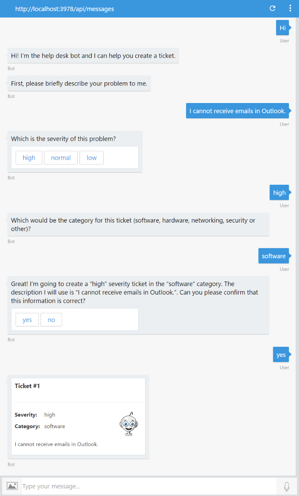

# Exercise 2: Submitting Help Desk Tickets

The goal of this exercise is to allow the user to submit help desk tickets by using the bot.

## Goals

To successfully complete this exercise, your bot must be able to perform the following tasks:

* Inform the user the current capabilities of the bot
* Ask the user for information about the problem
* Create an in-memory API to store ticket information

## Prerequisites

You must have either completed the prior exercise, or you can use the starting point provided for either [C#](./CSharp/exercise1-EchoBot) or [Node.js](./Node/exercise1-EchoBot).

## Introducing the Bot to the User

Whenever you create a bot you need to ensure the user knows what options are available to them. This is especially important when working in a conversational based interface, where the user tells the bot what she'd like the bot to do.

## Prompting for the Tickets Details

The trouble ticket needs to store the following information:

- Severity
  - High
  - Normal
  - Low
- Category
  - Software
  - Hardware
  - Networking
  - Security
- Description

The order in which the bot collects the information is up to you. You can use:
  * A waterfall pattern for the conversation flow
  * `Prompts.choice()` and `Prompts.text()` to prompt for the severity and category of the ticket.
  * `Prompts.confirm()` to confirm that the ticket information is correct.

## Adaptive Cards

You can also use an [Adaptive Cards](http://adaptivecards.io/) to show the ticket details.
  * For Node.js you can use the **ticket.json** file from the [assets/exercise2](../assets/exercise2-TicketSubmissionDialog) folder on the root of this hands-on lab as explained [here](https://docs.microsoft.com/en-us/bot-framework/rest-api/bot-framework-rest-connector-add-rich-cards#adaptive-card).
  * For C#, you can use the Microsoft.AdaptiveCards NuGet package as shown [here](https://docs.microsoft.com/en-us/bot-framework/dotnet/bot-builder-dotnet-add-rich-card-attachments#a-idadaptive-carda-add-an-adaptive-card-to-a-message).

Here is a sample conversation with the bot:

  

## In-memory Tickets API

Using either [Restify](http://restify.com/) for Node.js, or [Web API](https://www.asp.net/web-api) for C#, create a basic HTTP endpoint to store tickets in memory. The endpoint should accept POST calls with the ticket as the body of the message.

For purposes of this exercise, **no database or other eternal datastore** is needed; simply store the data in an array or list. The endpoint should be part of the same web application that hosts your bot.

> **NOTE:** When deploying your application to production, you may decide to separate your endpoint in a separate application. Typically you will be calling existing APIs.

## Resources

- [Getting started with Web API](https://docs.microsoft.com/en-us/aspnet/web-api/overview/getting-started-with-aspnet-web-api/tutorial-your-first-web-api)
- [Routing in Restify](http://restify.com/#common-handlers-serveruse)
- [Prompt users for input in Node.js](https://docs.microsoft.com/en-us/bot-framework/nodejs/bot-builder-nodejs-dialog-prompt)
- [Dialogs in the Bot Builder SDK for .NET](https://docs.microsoft.com/en-us/bot-framework/dotnet/bot-builder-dotnet-dialogs)

## Further Challenges

If you want to continue working on your own you can try with these tasks:

* Send a welcome message to the bot relying on the conversationUpdate event, as explained [here](https://docs.microsoft.com/en-us/bot-framework/nodejs/bot-builder-nodejs-handle-conversation-events#greet-a-user-on-conversation-join).
* Send a typing indicator to the bot while it calls the Tickets API, as explained [here](https://docs.microsoft.com/en-us/bot-framework/nodejs/bot-builder-nodejs-send-typing-indicator).