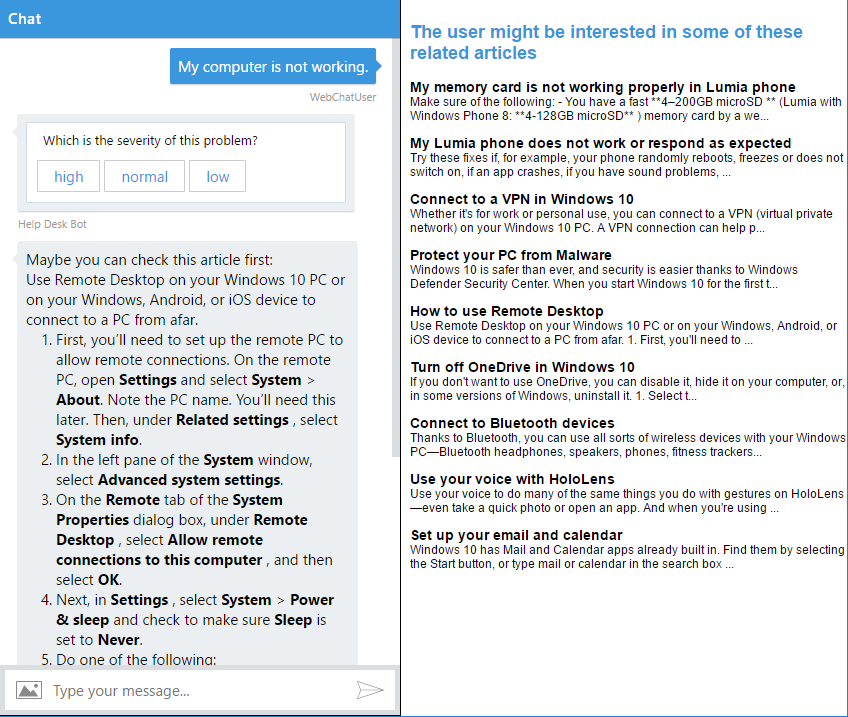

# Exercise 8: Send and Receive Events Through a Backchannel 

The backchannel mechanism allows a client app and the bot to exchange information that is invisible to the user. Examples of this could be from requesting the client's time zone to reading a GPS location or what the user is doing on a web page. The bot can even guide the user by automatically filling out parts of a web web form and so on. The backchannel closes the gap between JavaScript client apps and bots.

In this exercise, you will add a Web Page to your app. The bot and web page will use the backchannel mechanism to communicate. The bot will send the user's ticket to the web page, which will display related KB articles for that ticket. The goal would be that a human supervisor agent can monitor the conversation and by using the web page decide if there is an article that can help the user and avoid the creation of a ticket. If he finds an article, the supervisor agent can click it to display it in the user conversation with the bot.

The backchannel bot pattern is further explained in [this article](https://docs.microsoft.com/en-us/bot-framework/nodejs/bot-builder-nodejs-backchannel).

Inside these folders for either [C#](./CSharp/exercise8-BackChannel) or [Node.js](./Node/exercise7-BackChannel) you will find a solution with the code that results from completing the steps in this exercise. You can use this solution as guidance if you need additional help as you work through this exercise.

## Goals

To successfully complete this exercise, your bot must be able to perform the following actions interacting with the web page:

* When a user types the description of the ticket, the bot should perform a search in Azure Search and send the returned articles through a backchannel to a web app
* When the supervisor clicks on an article on the Web, the bot displays the article content

Here are some sample interactions with the bot and the web app:



## Prerequisites

* You must have either completed the prior exercise, or you can use the starting point provided for either [C#](./CSharp/exercise7-HandOffToHuman) or [Node.js](./Node/exercise7-HandOffToHuman)
* An account in the [LUIS Portal](https://www.luis.ai)
* An [Azure](https://azureinfo.microsoft.com/us-freetrial.html?cr_cc=200744395&wt.mc_id=usdx_evan_events_reg_dev_0_iottour_0_0) subscription

## Implementing the Backchannel Mechanism

### Client-side Code

* You should add an HTML page to your bot app. You can use the one provided in the assets folder [here](../assets/exercise8-BackChannel/default.htm).

* Using the Bot Framework Portal you should add a new App in the Web Chat channel of your bot to get the secret key. Then use it to open the Direct Line in the Web Page.

    ```javascript
    var botConnection = new BotChat.DirectLine({
        secret: '7p7PG8V34lc.cwA.RW8.rb6TL6nD0EqDVmcDdIRHztFQSdVCabAOQSNuKmyNGB0'
    });
    ```

* You should embed a Web Chat control in the web page, as explained [here](https://github.com/Microsoft/BotFramework-WebChat).

* Add a bot activity listener for activities where `type="event"` and `name="searchResults"`. Then show the search results sent by the bot throught the backchannel.

    ```javascript
    botConnection.activity$
        .filter(function (activity) {
            return activity.type === 'event' && activity.name === 'searchResults';
        })
        .subscribe(function (activity) {
            // show the search results
        });
    ```

### Server-side Code

* 

> **NOTE:** For simplicity purposes the Web Chat control with the user conversation and the search results are displayed on the same page. However, ideally these should be two separate things. The supervisor web site should display the list of the conversations in progress so an agent can monitor one and send the article recommendations.

## Resources

* [Microsoft Bot Framework WebChat control](https://github.com/Microsoft/BotFramework-WebChat)
* [Direct Line API](https://docs.botframework.com/en-us/restapi/directline3/#navtitle)
* [BackChannel Sample](https://github.com/Microsoft/BotFramework-WebChat/blob/master/samples/backchannel/index.html)
* [Backchannel Bot](https://github.com/ryanvolum/backChannelBot)
